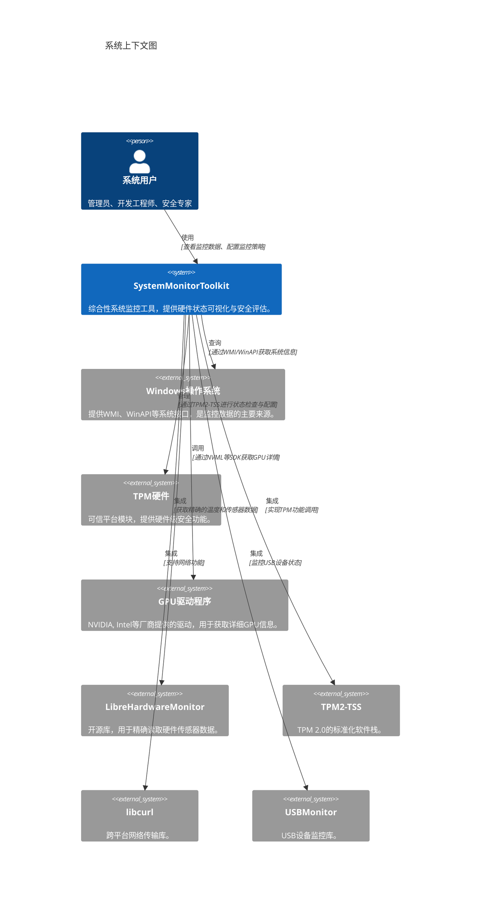
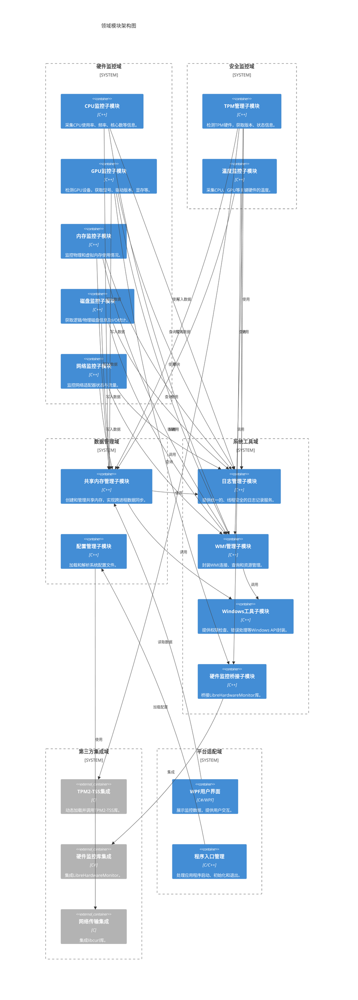
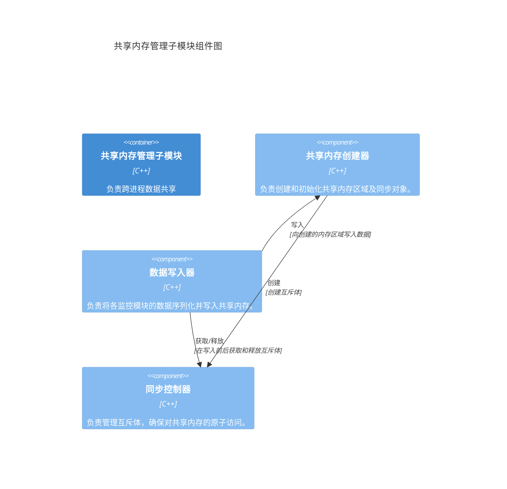
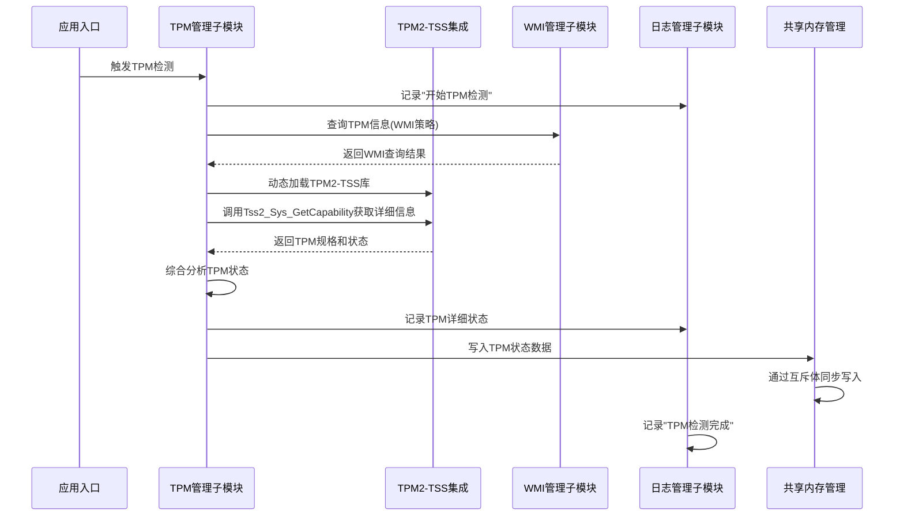
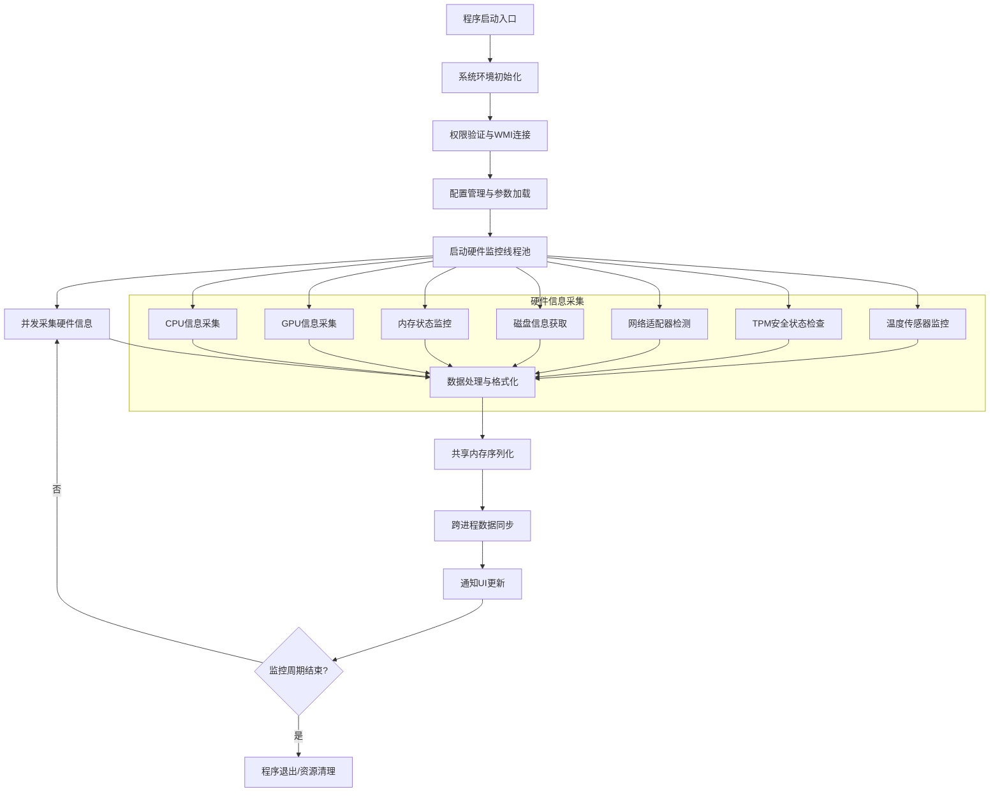
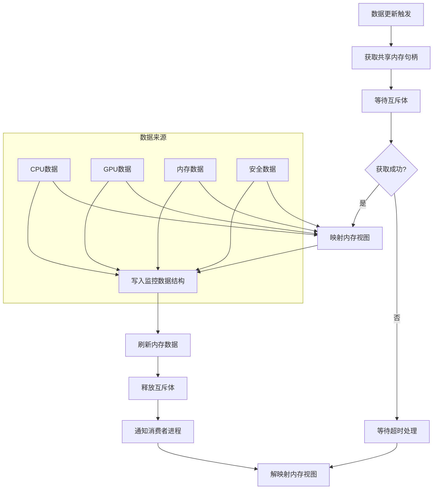
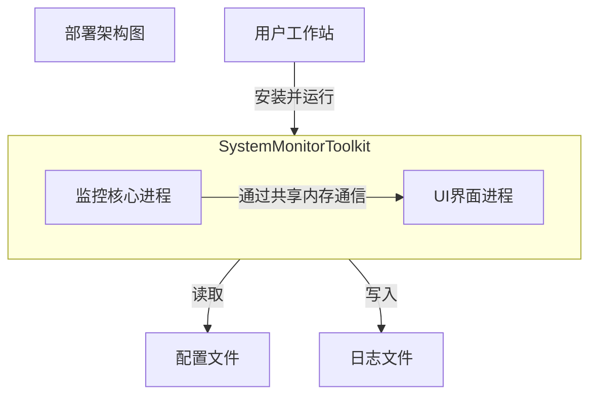

# 架构概览

## 1. 架构概览

SystemMonitorToolkit 是一个专为Windows平台设计的综合性系统监控工具，旨在为企业级用户提供全面、精准、实时的硬件状态可视化与安全评估能力。本系统采用经典的分层架构模式，结合模块化设计与领域驱动思想，构建了一个高内聚、低耦合、易于扩展和维护的技术体系。架构的核心设计理念在于**关注点分离**，将复杂的系统监控任务分解为独立的业务域，并通过标准化的接口和数据流进行协作，确保系统的稳定性、安全性和性能表现。

### 架构设计理念

本系统的架构设计遵循以下核心理念：

1.  **分层解耦**：通过清晰的分层结构，将用户界面、应用服务、业务逻辑、基础服务与系统接口有效隔离，降低了层与层之间的依赖性，提高了系统的可维护性和可测试性。
2.  **领域驱动**：系统以业务领域为导向划分为六个核心域（硬件监控域、安全监控域、数据管理域、系统工具域、第三方集成域、平台适配域），每个域 encapsulate 了特定的业务知识和技术实现，使得系统结构更贴近业务实际。
3.  **服务化协作**：各领域模块通过定义良好的服务接口进行交互，形成了松耦合的协作关系。这种设计允许模块独立演进，支持并行开发和部署。
4.  **集成与适配**：系统深度集成了多个业界成熟的开源库（如LibreHardwareMonitor、TPM2-TSS），通过适配器模式将其无缝融入自身架构，既扩展了功能，又保持了架构的整洁性。

### 核心架构模式

SystemMonitorToolkit 的架构实现综合运用了多种经典设计模式：

-   **分层架构模式**：这是系统的顶层架构模式，确保了依赖关系的单向性（上层依赖下层），为系统提供了稳定的纵向结构。
-   **适配器模式**：广泛应用于第三方库集成，如 `LibreHardwareMonitorBridge` 桥接硬件监控库，`TPM2-TSS` 集成适配器，以及 `WMIManager` 适配Windows管理接口，有效隔离了外部系统的复杂性。
-   **生产者-消费者模式**：C++核心监控模块作为数据生产者，将采集到的硬件信息写入共享内存；WPF用户界面作为消费者，从共享内存读取数据并展示。该模式通过共享内存实现了高效的跨进程数据交换。
-   **策略模式**：在硬件检测、温度采集等场景中，系统可根据配置或运行时环境选择不同的实现策略（如WMI、驱动API、第三方库），增强了系统的灵活性和适应性。

### 技术栈概述

系统的技术栈选型兼顾了性能、生态与开发效率：

-   **核心语言**：C++，用于实现高性能的硬件数据采集与处理逻辑。
-   **用户界面**：WPF (Windows Presentation Foundation) + C#，提供现代化的、数据驱动的桌面用户体验。
-   **跨进程通信**：Windows共享内存，实现低延迟、高吞吐量的数据共享。
-   **系统集成**：Windows Management Instrumentation (WMI)，作为获取系统信息的主要通道。
-   **第三方库**：
    -   **LibreHardwareMonitor**：用于精确的硬件传感器数据（尤其是温度）采集。
    -   **TPM2-TSS**：用于与TPM 2.0可信平台模块进行标准化交互。
    -   **libcurl**：提供网络传输能力，支持未来可能的远程数据上报或配置拉取。
-   **开发与构建**：Visual Studio，利用其强大的C++和C#开发环境及调试工具。

## 2. 系统上下文

### 系统定位与价值

SystemMonitorToolkit 定位为企业级Windows工作站的“数字仪表盘”，其核心业务价值在于将原本分散、复杂的硬件状态信息转化为直观、可操作的洞察。它帮助IT运维团队从被动的故障响应转向主动的性能优化和风险管理，通过持续的系统健康监控，显著降低意外停机时间，保障业务连续性。对于开发和安全团队，该工具提供了深入硬件层面的分析能力，是性能调优、安全合规审计不可或缺的利器，最终实现降低运维成本、提升系统安全性与稳定性的目标。

### 用户角色与场景

本系统主要服务于三类专业用户群体：

1.  **系统管理员**：
    -   **场景**：日常巡检、故障排查、性能基线建立。
    -   **需求**：实时查看CPU负载、内存占用、磁盘I/O、网络流量；识别性能瓶颈；快速定位异常硬件；评估系统整体健康状况。
2.  **开发工程师**：
    -   **场景**：应用程序性能分析、资源消耗评估、硬件兼容性测试。
    -   **需求**：获取精确的CPU型号、核心数、频率；监控应用运行时的GPU和内存使用情况；分析代码对硬件资源的具体影响。
3.  **安全专家**：
    -   **场景**：安全合规检查、可信计算环境验证、硬件级风险评估。
    -   **需求**：检查TPM芯片的启用状态与版本；监控关键硬件温度，防止过热导致的安全风险；审计硬件配置变更。

### 外部系统交互

SystemMonitorToolkit 并非孤立运行，它作为Windows生态系统中的一个信息枢纽，与多个外部系统和库进行交互，以获取和扩展其监控能力。



### 系统边界定义

-   **边界内**：
    -   硬件监控核心模块（CPU、GPU、内存、磁盘、网络监控）
    -   安全监控模块（TPM状态、温度传感器）
    -   数据管理与共享模块（共享内存管理器）
    -   WPF用户界面与视图模型
    -   配置管理与日志系统
    -   所有第三方库的适配与集成代码

-   **边界外**：
    -   **操作系统内核**：系统直接与内核提供的API（如WMI）交互，但不包含内核本身。
    -   **硬件驱动程序**：系统调用驱动提供的功能，但驱动的实现和更新不属于本系统范畴。
    -   **第三方监控软件**：如任务管理器、性能监视器等，本系统与它们是并列关系。
    -   **网络设备**：系统监控网络适配器的状态，但不监控路由器、交换机等外部网络设备。

## 3. 容器视图

容器视图从领域模块的层面展示了系统的高层结构，将系统划分为六个逻辑上内聚的领域，并阐述了它们之间的主要协作关系和数据流。

### 领域模块划分

1.  **硬件监控域**：核心业务域，负责CPU、GPU、内存、磁盘、网络等基础硬件信息的采集与状态评估。
2.  **安全监控域**：核心业务域，专注于TPM可信平台模块管理和硬件温度监控，提供系统安全维度的信息。
3.  **数据管理域**：基础设施域，负责监控数据的结构化组织、跨进程共享（共享内存）和系统配置管理。
4.  **系统工具域**：工具支撑域，提供日志记录、WMI访问、Windows API封装、时间处理等通用技术服务。
5.  **第三方集成域**：工具支撑域，负责与LibreHardwareMonitor、TPM2-TSS、libcurl等外部库的集成与适配。
6.  **平台适配域**：基础设施域，处理操作系统平台相关的信息，如OS版本检测，并承载WPF用户界面和程序入口逻辑。

### 领域模块架构

下图展示了SystemMonitorToolkit的容器级架构，清晰地描绘了六大领域模块及其内部的关键容器（子模块），以及它们之间的主要依赖关系。



### 存储设计

本系统不使用传统的数据库，其核心的“存储”机制是**共享内存**。

-   **实现方式**：通过Windows API (`CreateFileMapping`, `MapViewOfFile`) 创建一个命名的内存映射文件。
-   **数据结构**：共享内存中维护一个预定义的C++结构体（或类），该结构体包含了所有监控项的实时数据，如CPU使用率、各核心频率、GPU温度和负载、内存总量与使用量、TPM状态码等。这种扁平化的数据结构设计，最大限度地减少了序列化和反序列化的开销。
-   **同步机制**：为了防止读写冲突，系统使用**互斥体**来保护对共享内存的访问。数据生产者（C++监控模块）在更新数据前获取互斥体，写入后释放；数据消费者（WPF UI）在读取数据前也需获取互斥体，确保数据的一致性。
-   **优势**：共享内存提供了进程间最快的通信方式，避免了数据拷贝和网络协议栈的开销，非常适合本系统对高频率、低延迟数据交换的需求。

### 领域模块间通信

领域模块间的通信遵循分层和依赖倒置原则，主要模式如下：

-   **同步调用**：硬件监控域、安全监控域的子模块通过直接函数调用，同步请求系统工具域提供的服务，如调用 `Logger` 记录日志，调用 `WMIManager` 查询信息。
-   **数据写入**：各监控子模块将采集到的数据，通过调用 `SharedMemoryManager` 提供的接口，写入共享内存。这是一种单向的数据流。
-   **数据订阅**：WPF UI（平台适配域）作为消费者，周期性地从共享内存中读取最新数据并更新界面。这构成了一个典型的生产者-消费者模式。
-   **适配器调用**：硬件监控域和安全监控域通过系统工具域提供的适配器接口（如 `LibreHardwareMonitorBridge`），间接调用第三方集成域的功能，实现了对底层库的解耦。
-   **事件通知**：虽然当前实现主要基于轮询，但架构设计上支持扩展为事件驱动模型。例如，`SharedMemoryManager` 可在数据更新后通过事件或信号量通知UI，进一步提升效率。

## 4. 组件视图

组件视图深入到各个领域模块内部，剖析其核心组件的职责、关键功能以及它们之间的精细交互。

### 核心功能组件

核心功能组件主要分布在硬件监控域和安全监控域，是系统业务逻辑的直接体现。

-   **CPU监控子模块**：
    -   **职责**：全面负责中央处理器的状态监控。
    -   **关键功能**：通过WMI查询CPU基本信息（型号、核心数、逻辑处理器数）；使用性能计数器获取实时CPU使用率（总使用率及各核心使用率）；读取CPU当前运行频率。
-   **GPU监控子模块**：
    -   **职责**：检测和管理图形处理设备，区分物理GPU和虚拟GPU。
    -   **关键功能**：枚举系统中所有GPU设备；通过WMI或厂商SDK（如NVIDIA NVML）获取GPU详细信息（型号、驱动版本、显存大小、温度）；过滤掉RDP等场景下产生的虚拟GPU，确保数据准确性。
-   **TPM管理子模块**：
    -   **职责**：作为TPM安全功能的核心代理，提供TPM状态的全面视图。
    -   **关键功能**：采用双重策略（WMI查询和TBS接口调用）检测TPM硬件是否存在；通过集成的TPM2-TSS库，获取TPM的规格版本、制造商信息；检查TPM的启用、激活和所有者状态。
-   **温度监控子模块**：
    -   **职责**：统一采集和展示系统关键硬件的温度数据。
    -   **关键功能**：作为 `LibreHardwareMonitorBridge` 的主要调用者，获取CPU、GPU、主板、硬盘等硬件的温度传感器读数；对温度数据进行过滤和校准，与GPU监控子模块协同，确保只显示真实物理硬件的温度。

### 技术支撑组件

技术支撑组件为整个系统提供稳定、可靠的基础服务。

-   **共享内存管理子模块**：
    -   **职责**：跨进程数据共享的枢纽，是系统架构的关键组件。
    -   **关键功能**：在程序启动时创建指定大小的共享内存区域，并设置适当的安全描述符，允许目标进程访问；提供 `WriteData()` 接口，接收来自各监控模块的数据，并原子地更新到共享内存；提供 `ReadData()` 接口（或供UI直接内存映射读取）；管理互斥体的生命周期，保证读写同步。
-   **WMI管理子模块**：
    -   **职责**：封装与Windows管理接口（WMI）的复杂交互，提供统一的查询服务。
    -   **关键功能**：初始化COM库，设置COM安全级别；连接到WMI服务的默认命名空间（`root\cimv2`）；执行WQL查询，并处理返回的枚举器；自动管理COM对象的释放，防止内存泄漏。
-   **硬件监控桥接子模块**：
    -   **职责**：作为C++核心与C#实现的LibreHardwareMonitor库之间的桥梁。
    -   **关键功能**：通过C++/CLI或进程间通信机制调用LibreHardwareMonitor的API；将获取到的传感器数据进行类型转换和格式化，以适应C++核心的数据结构；负责LibreHardwareMonitor实例的生命周期管理。

### 组件职责划分



### 组件交互关系

以TPM安全管理流程为例，展示关键组件间的协作：



## 5. 关键流程

SystemMonitorToolkit 的运行由一系列精心设计的流程驱动，这些流程协同工作，实现了从系统启动到数据展示的完整闭环。

### 核心功能流程：系统监控完整工作流程

这是系统的主干流程，负责周期性地采集、处理并展示所有硬件监控数据。



**流程详解**：
1.  **启动与初始化**：应用程序启动后，首先进行基础环境设置，包括内存跟踪、标准文件描述符验证等。
2.  **服务准备**：初始化WMI连接，验证管理员权限，加载配置文件和第三方库。
3.  **并发采集**：系统启动一个后台线程池，各个硬件监控子模块（CPU、GPU等）作为独立任务并发执行，最大化采集效率。
4.  **数据处理**：各模块将原始数据（如WMI返回的复杂对象）转换为系统内部定义的标准化数据结构。
5.  **数据共享**：`SharedMemoryManager` 接收所有处理后的数据，加锁后将其更新到共享内存区域。
6.  **UI更新**：数据更新完毕后，通过某种同步机制（如信号量）通知WPF UI。UI从共享内存读取新数据，并刷新界面显示。

### 技术处理流程：监控数据共享流程

此流程是系统高性能跨进程通信的技术核心。



**流程详解**：
1.  **触发**：任何一个监控模块完成一轮数据采集后，触发此流程。
2.  **同步准备**：首先尝试获取用于保护共享内存的互斥体。这确保了在写入期间没有其他进程（包括另一个写入者或UI读取者）在访问数据。
3.  **内存操作**：成功获取互斥体后，将共享内存文件映射到当前进程的地址空间。
4.  **数据写入**：直接向映射的内存地址拷贝已更新的数据结构。这个过程非常快，因为它本质上是内存拷贝。
5.  **释放与通知**：写入完成后，释放互斥体，并触发一个事件（或设置一个信号量），来通知WPF UI有新数据可用。
6.  **异常处理**：如果在指定时间内无法获取互斥体，则视为超时，放弃本次写入，以避免线程长时间阻塞。

### 数据流转路径

系统内的数据流转呈现出清晰的“采集-处理-共享-消费”路径：

1.  **原始数据源**：Windows WMI服务、GPU驱动程序SDK、TPM 2.0 TSS接口、LibreHardwareMonitor库、Windows API。
2.  **采集与适配**：各监控子模块作为适配器，从上述数据源获取原始、异构的数据。
3.  **格式化与聚合**：原始数据在各自的子模块内被清洗、格式化，并聚合成统一的内部数据模型。
4.  **跨进程传输**：`SharedMemoryManager` 将所有模块的数据聚合成一个大结构体，通过共享内存进行广播。
5.  **消费与展示**：WPF UI的ViewModel层读取共享内存，将数据转换为可绑定的属性，最终在View层进行可视化展示。

### 异常处理机制

系统采用多层次的异常处理策略确保健壮性：

-   **模块级隔离**：每个监控模块在独立的线程中运行，其内部的异常（如WMI查询失败）不会导致整个系统崩溃。异常会被捕获，并通过`Logger`记录下来。
-   **降级服务**：如果某个高级数据源失败（如LibreHardwareMonitor无法初始化），系统会自动降级到基础数据源（如WMI），确保核心功能可用。
-   **日志记录**：`Logger`组件是异常处理的核心，它会记录详细的错误信息、时间戳和模块上下文，为问题排查提供依据。
-   **用户反馈**：关键错误（如TPM初始化失败）会通过UI向用户展示明确的错误信息和可能的解决方案。

## 6. 技术实现

### 核心模块实现：共享内存管理器

`SharedMemoryManager` 是架构中最具技术挑战性的模块之一，其实现细节直接决定了系统的性能和稳定性。

-   **创建与初始化**：
    -   使用 `CreateFileMapping` 创建一个内核文件映射对象，并指定一个全局唯一的名称（如`"Global\\SystemMonitorToolkitSM"`），以便跨进程访问。
    -   安全描述符（`SECURITY_ATTRIBUTES`）被精心配置，允许具有特定权限的用户（如管理员）组的进程访问，同时防止未授权访问。
-   **数据结构设计**：
    -   共享内存的核心是一个C++ `struct`，例如 `SystemMonitorData`。
    -   该结构体采用**版本号**字段，以便在数据结构演进时，消费者可以识别并兼容不同版本的数据。
    -   所有字段都被显式地对齐（如使用 `#pragma pack`），避免编译器优化导致的数据布局不一致。
    -   布尔标志位（如`bTPMAvailable`）用于表示某个数据域是否有效，避免消费者读取到无效或未初始化的数据。
-   **同步机制**：
    -   使用 `CreateMutex` 创建一个命名互斥体（如`"Global\\SystemMonitorToolkitSM_Mutex"`）。
    -   写入线程在操作前调用 `WaitForSingleObject`，操作后调用 `ReleaseMutex`。
    -   UI读取线程也遵循相同的加锁逻辑，确保读取到的是一致的数据快照。等待超时被设置为一个合理的值（如100ms），避免UI冻结。

### 关键算法设计：虚拟GPU过滤算法

在多GPU或远程桌面环境中，系统可能会检测到非物理的虚拟GPU。提供准确信息的核心在于过滤算法。

```cpp
// 伪代码：GPU过滤逻辑
std::vector<GPUInfo> FilterPhysicalGPUs(const std::vector<GPUInfo>& all_gpus) {
    std::vector<GPUInfo> physical_gpus;
    for (const auto& gpu : all_gpus) {
        // 规则1: 过滤掉名称包含特定虚拟化关键词的GPU
        if (gpu.name.find("Microsoft Remote Display") != std::string::npos ||
            gpu.name.find("Mirage") != std::string::npos) {
            continue;
        }

        // 规则2: NVIDIA GPU, 检查NVML是否能获取到详细信息
        if (gpu.vendor == "NVIDIA") {
            if (IsNVMLAvailable() && GetNVMLDetails(gpu.id).isValid()) {
                physical_gpus.push_back(gpu);
            }
        }
        // 规则3: Intel GPU, 检查是否是集成显卡且存在独立显卡
        else if (gpu.vendor == "Intel") {
            // 如果已有NVIDIA/AMD卡，则跳过Intel集成显卡（除非是唯一显卡）
            if (!HasDiscreteGPU(all_gpus) || all_gpus.size() == 1) {
                physical_gpus.push_back(gpu);
            }
        }
        // 规则4: 其他厂商，默认认为是物理设备
        else {
            physical_gpus.push_back(gpu);
        }
    }
    return physical_gpus;
}
```
该算法结合了基于名称的启发式规则和能力探测（如NVML调用），有效提升了监控数据的准确性。

### 性能优化策略

-   **异步采集**：所有耗时的I/O操作（WMI查询、库调用）均在后台线程中执行，绝不阻塞UI线程。
-   **批量操作**：`SharedMemoryManager` 采用批量写入策略，即等待一个微小周期（如50ms）内的所有数据更新后，一次性加锁并写入，减少了锁竞争的频率。
-   **内存池化**：对于频繁创建和销毁的小对象（如WMI查询结果），可以引入对象池模式，减少内存分配开销。
-   **缓存策略**：对于变化缓慢的信息（如CPU型号、磁盘大小），在程序启动时获取一次并缓存，避免在每个监控周期中重复查询。

## 7. 部署架构

### 运行环境要求

-   **操作系统**：Windows 10 / Windows Server 2016 及以上版本，以支持完整的WMI类和TPM 2.0功能。
-   **框架**：.NET Framework 4.7.2 或更高版本（用于WPF UI部分）。
-   **运行时库**：Visual C++ Redistributable for Visual Studio（与编译版本匹配）。
-   **权限**：建议以**管理员身份**运行，以确保能够访问所有WMI类、TPM信息和部分硬件寄存器。普通用户模式下部分功能可能受限。
-   **硬件依赖**：TPM 2.0芯片（用于TPM相关功能），支持WMI的硬件。

### 部署拓扑结构

SystemMonitorToolkit 是一个单机桌面应用程序，其部署拓扑非常简单。



**部署说明**：
-   系统可打包为单个安装包（如MSI），包含所有必要的可执行文件、DLL、配置文件和依赖库。
-   安装过程会将文件部署到 `Program Files` 目录，并创建开始菜单快捷方式。
-   运行时，会同时启动一个后台的核心监控进程和一个前台的UI进程，两者通过共享内存协作。

### 扩展性设计

-   **监控项扩展**：新增硬件监控（如新增一种传感器类型）只需：
    1.  在 `SystemMonitorData` 结构体中添加新字段。
    2.  创建一个新的监控子模块，实现标准的采集接口。
    3.  在 `SharedMemoryManager` 中注册并调用该新模块。
    4.  在WPF UI中添加相应的数据显示控件。
-   **平台扩展**：虽然当前专注于Windows，但分层架构设计为未来支持其他平台（如Linux）留下了空间。只需替换平台适配域和系统工具域的实现（如用`sysfs`替代WMI），而上层业务逻辑可以保持不变。

### 监控与运维

-   **日志**：`Logger`组件将日志输出到可配置的文件（如`Logs/SystemMonitorToolkit.log`），支持按日期或大小滚动。日志级别（DEBUG, INFO, WARN, ERROR）可配置，便于问题诊断。
-   **配置**：核心监控参数（如采集周期、共享内存大小、日志级别）可通过配置文件修改，无需重新编译。
-   **健康检查**：UI进程会定期检查核心进程是否存活，以及共享内存数据是否在正常更新。如果检测到异常，会向用户发出警告。
-   **资源占用**：系统设计时已考虑资源消耗，后台监控进程在空闲时CPU占用率极低，共享内存大小固定（通常小于1MB），整体资源开销对工作站影响甚微。