# 核心工作流程

## 1. 工作流程概览 (Workflow Overview)

### 1.1 系统主干工作流程

SystemMonitorToolkit的核心工作流程是一个完整的系统监控与数据采集流程，涵盖了从程序启动、硬件信息采集、数据处理到跨进程共享的全过程。该流程是系统的核心主干工作流，负责收集、处理和管理系统各个硬件组件的实时状态信息。

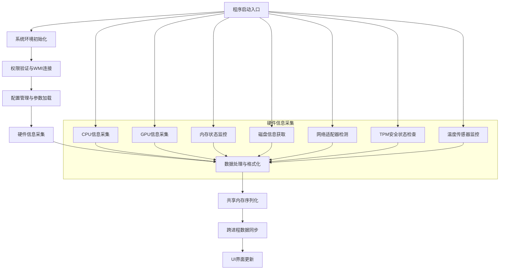

### 1.2 核心执行路径

系统的核心执行路径遵循以下关键步骤：

1. **初始化阶段**：通过`tool_main.c`进行平台特定的环境设置，包括Windows、VMS、MinGW等多平台适配
2. **权限验证阶段**：通过`WinUtils.cpp`验证管理员权限，确保具备系统监控所需的必要权限
3. **WMI连接阶段**：通过`WMIManager.cpp`建立Windows Management Instrumentation服务连接
4. **并行采集阶段**：各硬件监控模块(CPU、GPU、内存、磁盘、网络、TPM、温度)并行执行信息采集
5. **数据整合阶段**：通过`SharedMemoryManager.cpp`将所有监控数据统一序列化到共享内存
6. **界面更新阶段**：WPF界面从共享内存读取数据并实时更新显示

### 1.3 关键流程节点

| 流程节点 | 关键组件 | 功能描述 | 重要性 |
|---------|---------|---------|--------|
| 程序入口 | `tool_main.c` | 应用程序启动和基础环境初始化 | 10.0 |
| 权限管理 | `WinUtils.cpp` | 系统权限验证和管理员身份检查 | 9.0 |
| WMI服务 | `WMIManager.cpp` | Windows管理接口连接和初始化 | 9.0 |
| 硬件监控 | `CpuInfo.cpp`, `GpuInfo.cpp`等 | 各硬件组件信息采集 | 10.0 |
| 数据共享 | `SharedMemoryManager.cpp` | 跨进程数据同步和共享 | 9.0 |
| TPM管理 | `TpmInfo.cpp` | 可信平台模块状态检测 | 8.0 |

### 1.4 流程协调机制

系统采用多种协调机制确保各模块有序协作：

- **异步协调**：硬件监控各模块采用异步并行执行模式，提高采集效率
- **同步机制**：通过共享内存互斥锁确保数据一致性
- **事件驱动**：采用Qt信号槽机制处理USB设备等异步事件
- **状态管理**：通过RAII模式管理资源生命周期，确保异常安全

## 2. 主要工作流程 (Main Workflows)

### 2.1 系统硬件检测流程

这是系统的核心业务流程，负责全面检测和收集系统各个硬件组件的状态信息。

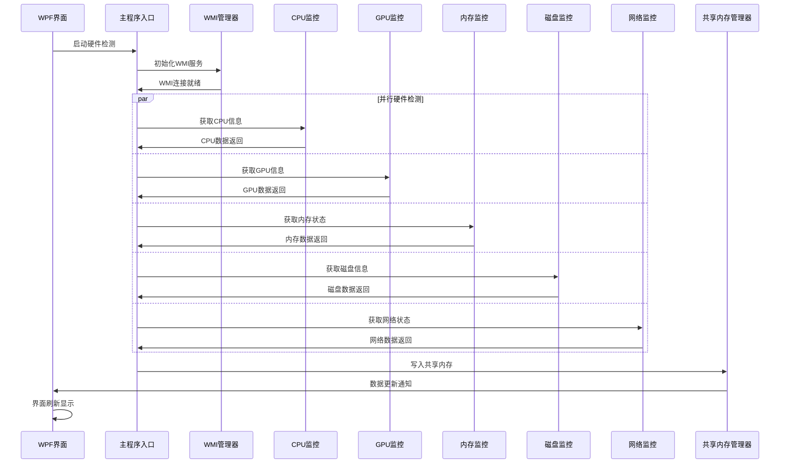

**流程执行步骤：**

1. **程序初始化** (`tool_main.c`)
   - 平台特定环境设置
   - 标准文件描述符验证
   - 内存跟踪机制初始化（调试模式）

2. **WMI服务连接** (`WMIManager.cpp`)
   - COM安全初始化
   - WMI定位器创建
   - 命名空间连接
   - 代理安全级别设置

3. **CPU信息采集** (`CpuInfo.cpp`)
   - 通过PDH API获取CPU使用率
   - 通过ACPI接口获取频率信息
   - CPU核心架构检测（大核/小核）
   - 超线程和虚拟化技术检测

4. **GPU信息采集** (`GpuInfo.cpp`)
   - WMI查询显卡基本信息
   - 虚拟GPU智能识别
   - NVIDIA GPU通过NVML获取详细信息
   - Intel GPU通过DXGI获取专用显存

5. **内存状态监控** (`MemoryInfo.cpp`)
   - 通过GlobalMemoryStatusEx获取系统内存状态
   - 物理内存和虚拟内存信息收集
   - 内存使用率分析计算

6. **磁盘信息获取** (`DiskInfo.cpp`)
   - 逻辑驱动器信息获取（盘符、空间、文件系统）
   - 物理磁盘详细信息（型号、序列号、接口类型）
   - 物理磁盘与逻辑盘符映射关系建立

7. **网络适配器检测** (`NetworkAdapter.cpp`)
   - 通过WMI和GetAdaptersAddresses双重机制获取信息
   - 虚拟适配器智能过滤
   - 网络连接状态和传输速度监控

### 2.2 TPM安全管理流程

这是系统的安全核心流程，负责TPM可信平台模块的检测、状态验证和安全策略管理。

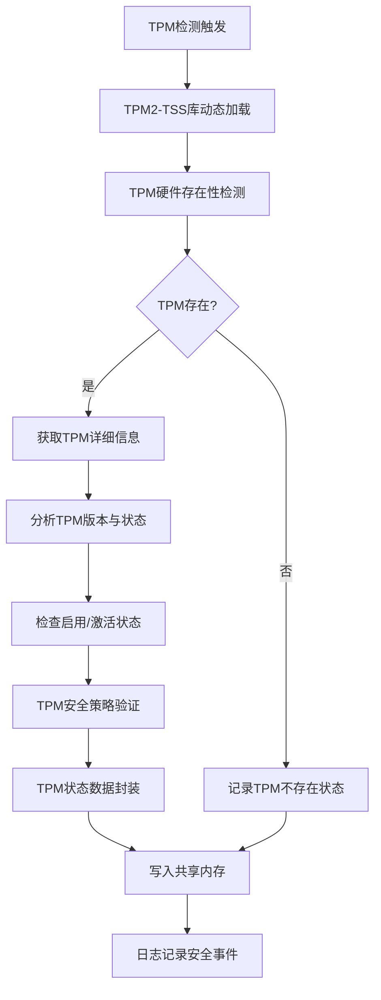

**流程执行细节：**

1. **TPM2-TSS动态加载** (`tss2-dlopen-fapi.c`)
   - 运行时动态加载libtss2-fapi.so.1库
   - 提供与原生库相同的接口函数
   - 错误处理机制，库不存在时返回NOT_IMPLEMENTED

2. **TPM硬件检测** (`TpmInfo.cpp`)
   - 优先使用TBS（TPM Base Services）API
   - WMI作为备用检测方案
   - 双重检测策略确保可靠性

3. **TPM状态分析** (`Tss2_Sys_Startup.c`等)
   - 调用TPM2系统API获取详细信息
   - 支持TPM 1.2和2.0版本识别
   - 分析就绪状态（Ready/EnabledNotActivated/Disabled）

4. **安全策略验证**
   - TPM启用状态检查
   - 激活状态验证
   - 所有权状态确认

5. **数据封装与共享**
   - TPM状态数据结构化封装
   - 写入共享内存供其他进程访问
   - 安全事件日志记录

### 2.3 监控数据共享流程

这是系统的基础设施流程，实现跨进程的监控数据共享和同步。

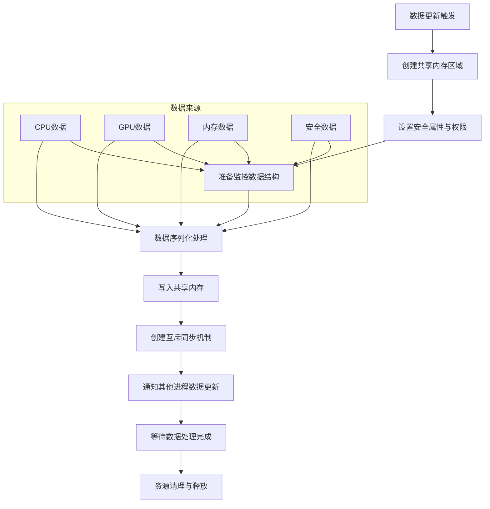

**流程关键环节：**

1. **共享内存创建** (`SharedMemoryManager.cpp`)
   - 创建具有适当安全属性的内存映射对象
   - 支持全局和本地命名空间
   - 权限管理确保数据访问安全

2. **数据序列化处理**
   - 复杂系统信息数据结构序列化
   - CPU、内存、GPU、磁盘、网络、温度传感器、TPM等数据统一格式化
   - 字节序转换和内存对齐处理

3. **跨进程同步机制**
   - 互斥锁实现进程间同步
   - 原子操作确保数据一致性
   - 事件通知机制触发数据更新

4. **资源管理**
   - RAII模式管理资源生命周期
   - 异常安全保证
   - 内存泄漏防护

### 2.4 配置管理与初始化流程

这是系统的基础支撑流程，负责应用程序启动时的环境设置和配置管理。

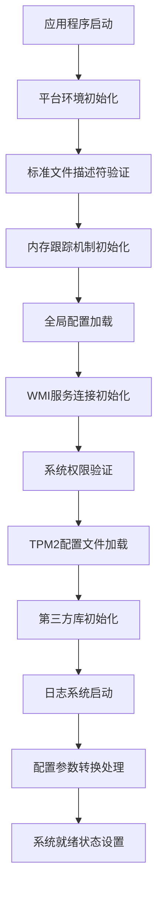

**流程执行机制：**

1. **多平台环境初始化**
   - 条件编译支持Windows、VMS、MinGW等平台
   - 平台特定的环境变量设置
   - 字符编码转换处理

2. **配置文件管理** (`ifapi_config.c`)
   - JSON格式配置文件解析
   - 异步配置文件读取操作
   - 路径展开功能（~和$HOME符号替换）
   - 配置完整性验证

3. **配置转换处理** (`config2setopts.c`)
   - OperationConfig到CURL easy handle转换
   - 协议特定配置处理
   - SSL/TLS安全配置
   - 100+种配置选项支持

## 3. 流程协调与控制 (Flow Coordination)

### 3.1 多模块协调机制

系统采用分层的模块协调架构，确保各组件高效协作：

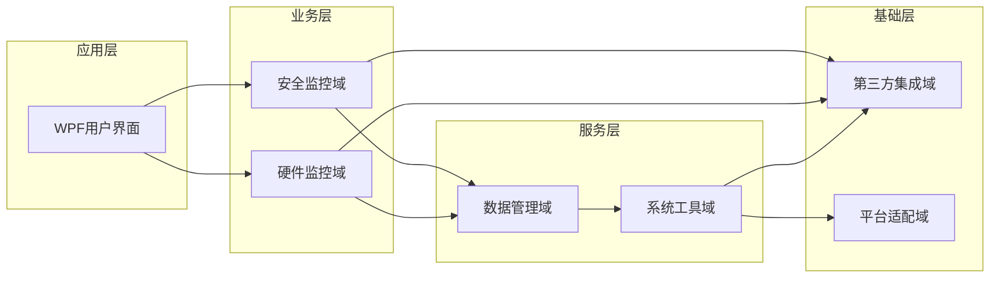

**协调机制特点：**

1. **分层解耦**：各层通过明确的接口进行交互，降低耦合度
2. **异步并行**：硬件监控各模块采用异步并行执行
3. **事件驱动**：通过事件机制协调模块间通信
4. **依赖注入**：通过依赖注入实现模块间松耦合

### 3.2 状态管理和同步

**状态管理机制：**

1. **全局状态管理**
   - 系统就绪状态跟踪
   - 各模块状态监控
   - 错误状态传播机制

2. **数据同步策略**
   - 共享内存原子操作
   - 版本控制机制
   - 增量更新优化

3. **并发控制**
   - 读写锁机制
   - 互斥量保护关键区域
   - 无锁数据结构优化性能

### 3.3 数据传递和共享

**数据流转机制：**

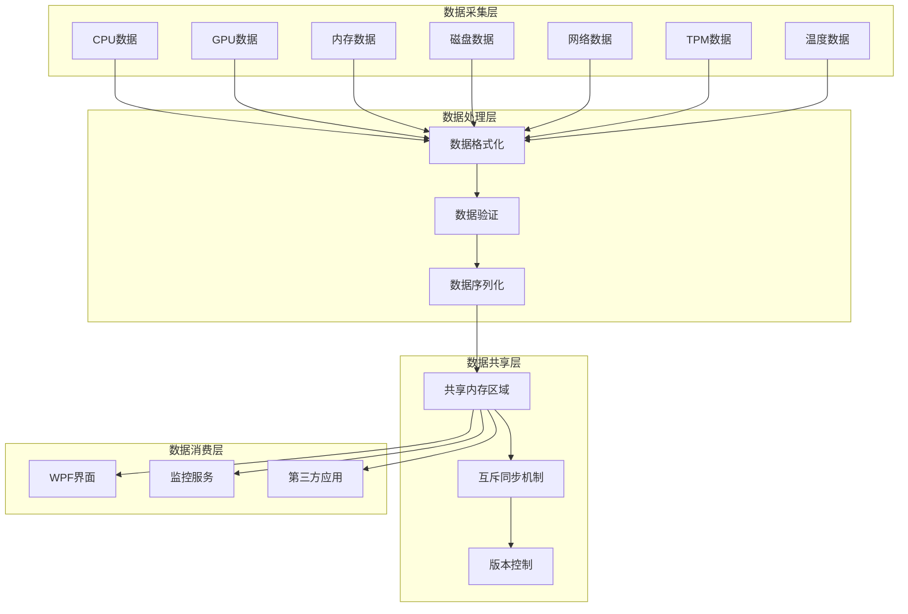

### 3.4 执行控制和调度

**调度策略：**

1. **优先级调度**
   - 关键监控任务高优先级
   - 后台任务低优先级
   - 用户交互任务实时响应

2. **负载均衡**
   - 多线程并行处理
   - 任务队列管理
   - 资源使用监控

3. **自适应调整**
   - 根据系统负载调整采集频率
   - 动态资源分配
   - 性能优化策略

## 4. 异常处理与恢复 (Exception Handling)

### 4.1 错误检测和处理

**多层次错误处理架构：**

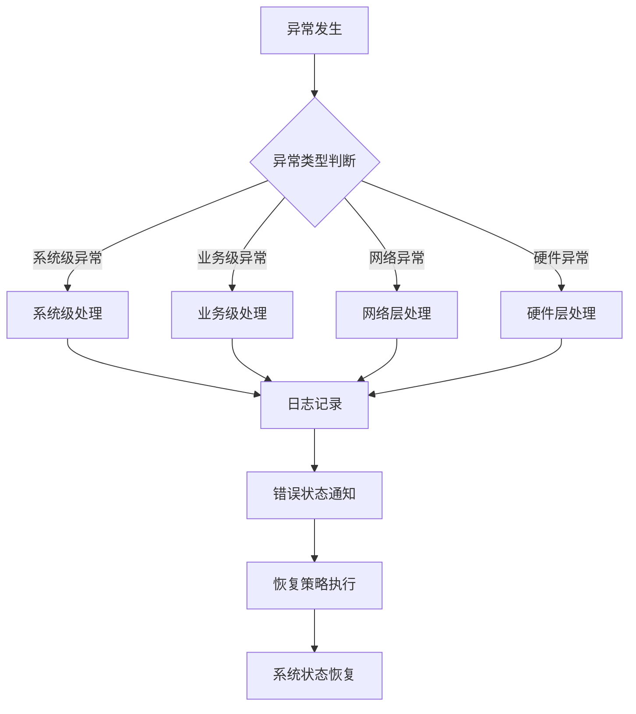

**具体处理机制：**

1. **硬件监控异常处理**
   - WMI连接失败：自动重试机制，最多3次
   - 硬件访问权限不足：提示用户提升权限
   - 硬件不存在：标记为不可用并记录日志

2. **TPM安全异常处理**
   - TPM2-TSS库加载失败：优雅降级，禁用TPM功能
   - TPM硬件不存在：记录状态并继续其他监控
   - TPM访问权限不足：安全事件记录和用户通知

3. **共享内存异常处理**
   - 内存分配失败：清理现有资源并重试
   - 进程同步失败：重建同步机制
   - 数据损坏：触发数据重新采集

### 4.2 异常恢复机制

**恢复策略矩阵：**

| 异常类型 | 恢复策略 | 重试次数 | 超时时间 | 降级方案 |
|---------|---------|---------|---------|---------|
| WMI连接失败 | 自动重连 | 3次 | 5秒 | 禁用WMI功能 |
| TPM库加载失败 | 动态加载重试 | 2次 | 3秒 | 禁用TPM监控 |
| 共享内存错误 | 重新创建 | 5次 | 2秒 | 本地存储模式 |
| 网络适配器错误 | 重新扫描 | 3次 | 10秒 | 缓存上次数据 |
| GPU监控失败 | 切换检测方式 | 2次 | 5秒 | 基础GPU信息 |

### 4.3 容错策略设计

**容错机制：**

1. **冗余检测**
   - TPM检测：TBS + WMI双重策略
   - GPU信息：WMI + NVML/DXGI多重来源
   - 网络信息：WMI + GetAdaptersAddresses双重验证

2. **优雅降级**
   - 关键功能失败时保持基础功能可用
   - 非核心模块异常不影响主流程
   - 用户友好的错误提示和恢复建议

3. **数据完整性保护**
   - 数据校验和验证
   - 原子操作确保数据一致性
   - 回滚机制保护数据状态

### 4.4 失败重试和降级

**智能重试算法：**

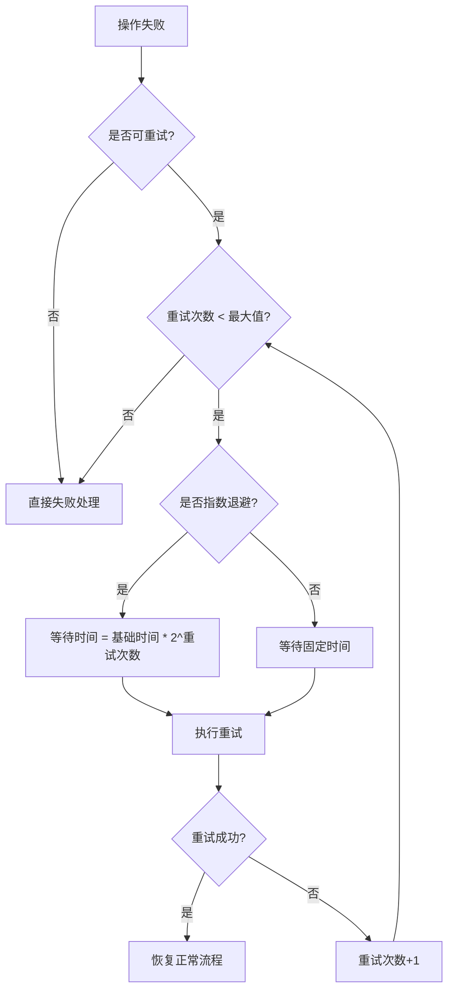

## 5. 关键流程实现 (Key Process Implementation)

### 5.1 核心算法流程

#### 5.1.1 GPU虚拟设备识别算法

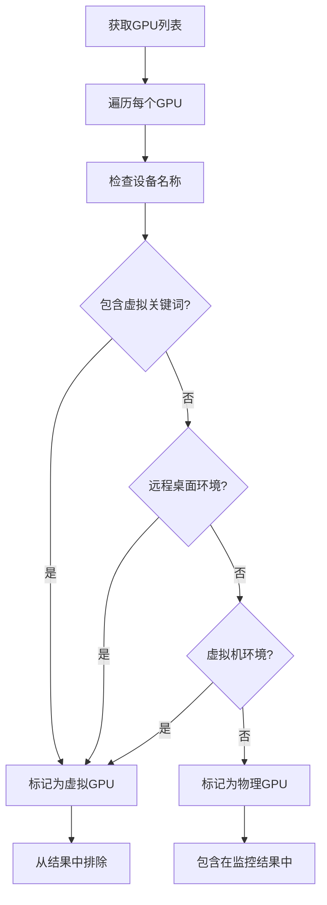

**算法实现细节：**

1. **虚拟GPU关键词匹配**
   - 内置虚拟GPU名称列表
   - 模糊匹配算法提高识别准确性
   - 支持多语言环境适配

2. **环境检测机制**
   - 检测远程桌面会话
   - 识别虚拟机环境
   - 判断容器化部署场景

#### 5.1.2 CPU核心架构检测算法

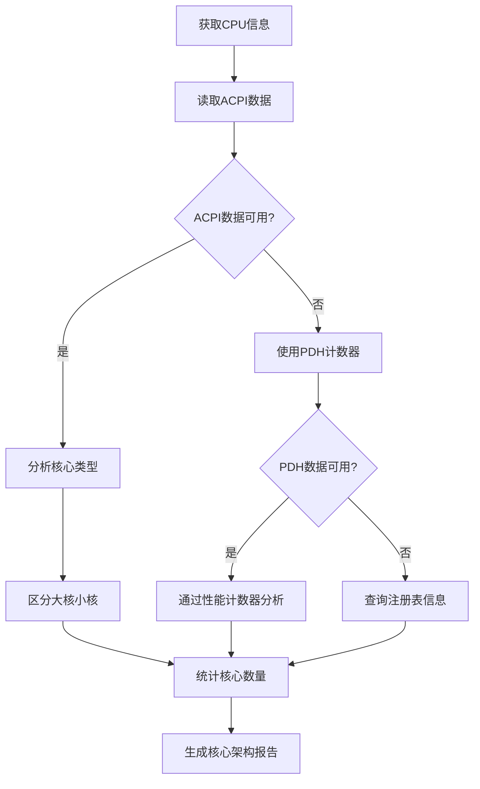

### 5.2 数据处理管道

#### 5.2.1 监控数据处理流程

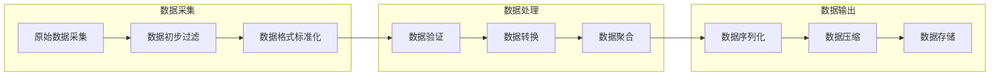

**处理管道特点：**

1. **流式处理**：数据流经各个处理阶段，支持实时处理
2. **并行处理**：多个数据流可并行处理，提高吞吐量
3. **错误隔离**：单个数据流错误不影响其他数据流处理

#### 5.2.2 共享内存数据序列化

**序列化流程：**

1. **数据结构定义**
   - 统一的数据格式规范
   - 版本兼容性设计
   - 扩展字段预留

2. **序列化算法**
   - 高效的二进制序列化
   - 字节序转换处理
   - 内存对齐优化

3. **压缩优化**
   - 数据去重算法
   - 增量更新机制
   - 压缩比例优化

### 5.3 业务规则执行

#### 5.3.1 硬件状态评估规则

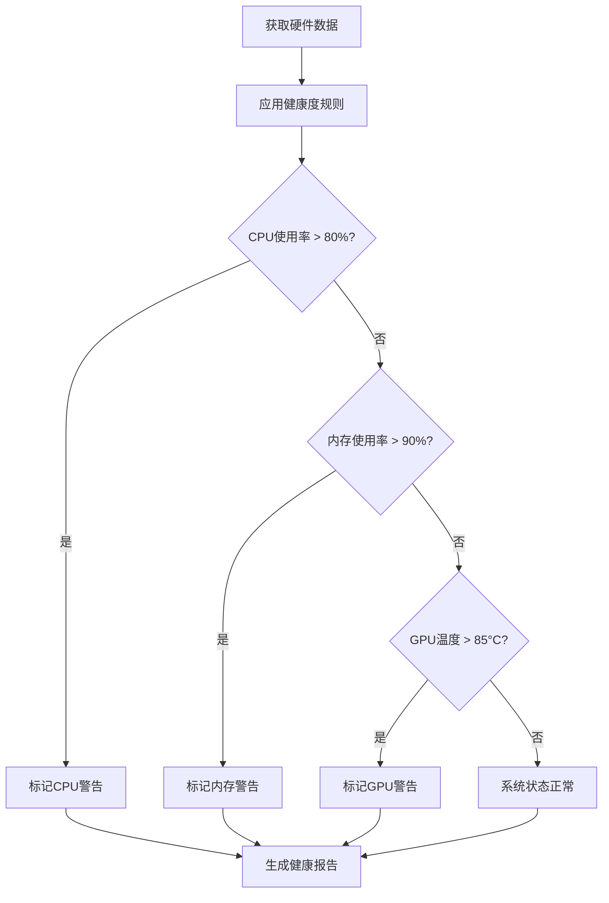

#### 5.3.2 安全合规性检查规则

**TPM安全检查流程：**

1. **TPM存在性检查**
   - 硬件级别检测
   - 驱动程序验证
   - 服务状态确认

2. **配置合规性验证**
   - TPM版本要求检查
   - 安全策略验证
   - 加密算法合规性

3. **运行时状态监控**
   - TPM就绪状态
   - 密钥管理状态
   - 安全事件监控

### 5.4 技术实现细节

#### 5.4.1 WMI服务管理实现

**WMI连接管理流程：**

```cpp
// 伪代码示例
class WMIManager {
    bool InitializeWMI() {
        // 1. COM安全初始化
        if (!InitializeCOMSecurity()) return false;
        
        // 2. 创建WMI定位器
        IWbemLocator* pLocator = nullptr;
        HRESULT hr = CoCreateInstance(...);
        
        // 3. 连接到WMI命名空间
        IWbemServices* pService = nullptr;
        hr = pLocator->ConnectServer(...);
        
        // 4. 设置代理安全级别
        CoSetProxyBlanket(pService, ...);
        
        return SUCCEEDED(hr);
    }
};
```

#### 5.4.2 共享内存同步机制

**互斥同步实现：**

```cpp
// 伪代码示例
class SharedMemoryManager {
    bool WriteData(const MonitorData& data) {
        // 1. 获取互斥锁
        WaitForSingleObject(hMutex, INFINITE);
        
        try {
            // 2. 序列化数据
            SerializeData(data);
            
            // 3. 更新版本号
            UpdateVersion();
            
            // 4. 通知其他进程
            SetEvent(hUpdateEvent);
            
            return true;
        } catch (...) {
            return false;
        } finally {
            // 5. 释放互斥锁
            ReleaseMutex(hMutex);
        }
    }
};
```

#### 5.4.3 温度数据集成实现

**多源数据融合算法：**

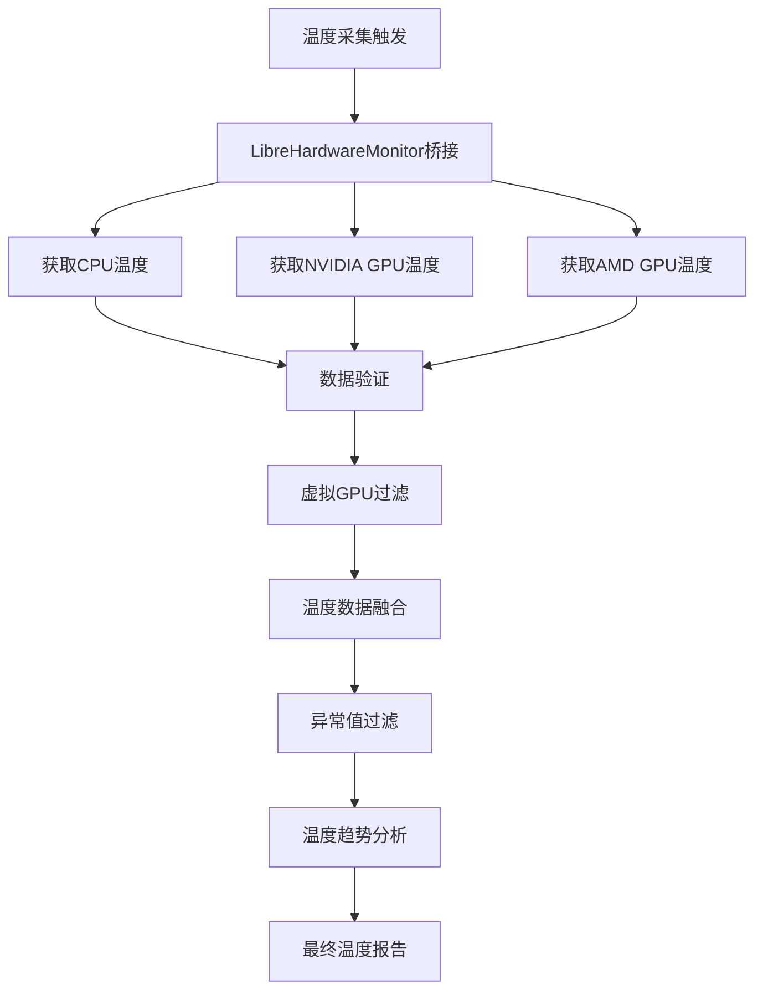

**实现特点：**

1. **多源数据融合**：整合多个温度传感器数据源
2. **智能过滤**：过滤异常值和虚拟设备数据
3. **趋势分析**：提供温度变化趋势和预测
4. **告警机制**：温度异常时的告警和建议

通过以上详细的工作流程分析和实现细节，SystemMonitorToolkit构建了一个完整、高效、可靠的系统监控解决方案，为企业级IT运维提供了强大的硬件状态监控和性能分析能力。