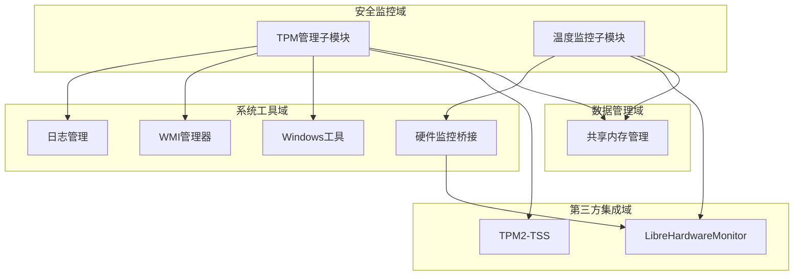
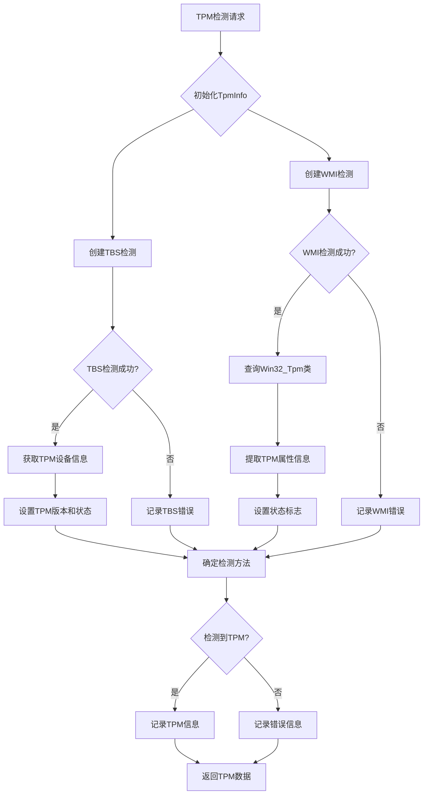
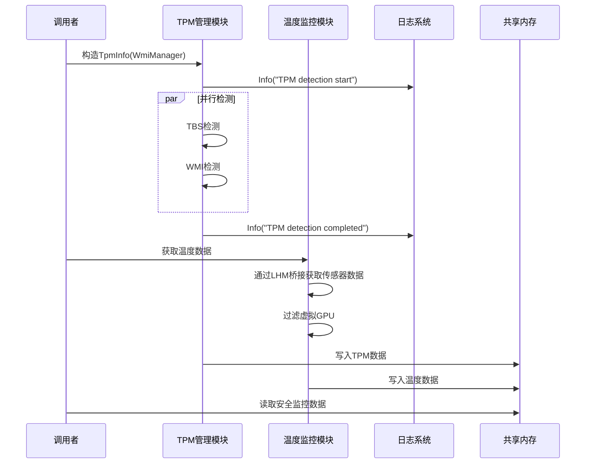

基于提供的调研材料，我将为您编写SystemMonitorToolkit系统中安全监控域的技术实现文档。

# 安全监控域技术实现文档

## 1. 模块概述

安全监控域是SystemMonitorToolkit系统的核心业务域之一，专注于系统安全相关的硬件和功能模块监控。该领域包含两个关键子模块：TPM管理子模块和温度监控子模块，负责确保系统的安全合规性和硬件级别的安全保障。

### 1.1 业务价值
- 为企业级系统提供硬件级安全状态评估
- 支持安全专家进行安全审计和合规性检查
- 监控关键硬件温度，预防硬件故障导致的安全风险
- 提供TPM可信平台模块的完整管理能力

### 1.2 技术定位
- **领域类型**：核心业务域
- **复杂度评分**：7.0/10
- **重要性评分**：9.0/10
- **代码路径**：`src/core/tpm/`、`src/core/temperature/`

## 2. 架构设计

### 2.1 模块结构



### 2.2 设计原则
- **双重检测策略**：TPM检测采用TBS API + WMI互为备份
- **异常隔离**：单个检测方法失败不影响其他检测流程
- **RAII资源管理**：确保系统资源的正确释放
- **模块化设计**：高内聚低耦合，支持独立开发和测试

## 3. 子模块详细实现

### 3.1 TPM管理子模块

#### 3.1.1 功能概述
TPM管理子模块是安全监控域的核心组件，专注于可信平台模块(TPM)的检测和状态管理。该模块能够全面获取TPM的硬件信息，包括制造商、版本号、激活状态、所有权状态等关键属性。

#### 3.1.2 技术实现

**核心类结构**：
```cpp
class TpmInfo {
private:
    // TPM数据结构
    TpmData tpmData;
    
    // 检测方法标识
    DetectionMethod detectionMethod;
    
    // 依赖注入组件
    WmiManager* wmiManager;
    
public:
    // 构造函数，执行初始化检测
    TpmInfo(WmiManager* wmiMgr);
    
    // 获取TPM数据
    const TpmData& GetTpmData() const;
    
private:
    // TBS检测方法
    bool DetectViaTbs();
    
    // WMI检测方法
    bool DetectViaWmi();
    
    // 确定最终检测方法
    void DetermineDetectionMethod();
};
```

**关键技术特性**：

1. **双重检测策略**
   - **TBS检测**：通过TPM Base Services API直接访问硬件
   - **WMI检测**：通过Windows Management Instrumentation获取信息
   - **智能合并**：通过`SetStatusIfEmpty`函数优先保留TBS检测结果

2. **RAII资源管理**
   ```cpp
   struct TbsContextGuard {
       TBS_CONTEXT_HANDLE context;
       
       TbsContextGuard() {
           Tbsi_Context_Create(&context);
       }
       
       ~TbsContextGuard() {
           if (context) {
               Tbsi_Context_Close(context);
           }
       }
   };
   ```

3. **错误处理机制**
   - `MapTbsError`函数实现TBS错误码到可读字符串的映射
   - 异常隔离确保一个检测方法失败不影响另一个
   - 统一的日志记录机制

#### 3.1.3 检测流程



#### 3.1.4 依赖库集成
- **动态库加载**：tbs.lib、ole32.lib、comutil.lib
- **TPM2-TSS集成**：通过第三方集成域访问TPM 2.0功能
- **WMI服务**：通过系统工具域的WMIManager进行访问

### 3.2 温度监控子模块

#### 3.2.1 功能概述
温度监控子模块负责系统硬件温度传感器数据的采集和管理，通过集成LibreHardwareMonitor库获取精确的温度数据，并提供虚拟GPU过滤功能。

#### 3.2.2 技术实现

**核心实现特点**：

1. **硬件桥接集成**
   ```cpp
   class TemperatureWrapper {
   private:
       LibreHardwareMonitorBridge* hwBridge;
       
   public:
       // 获取CPU温度
       float GetCpuTemperature();
       
       // 获取GPU温度（过滤虚拟GPU）
       std::vector<GpuTemperature> GetGpuTemperatures();
   };
   ```

2. **虚拟GPU过滤机制**
   - 识别并排除虚拟GPU设备
   - 仅提供物理硬件的温度数据
   - 确保温度数据的准确性和可靠性

3. **数据集成策略**
   - 通过LibreHardwareMonitorBridge桥接获取传感器数据
   - 支持多GPU温度同时监控
   - 提供统一的温度数据接口

#### 3.2.3 与硬件监控域协作
温度监控子模块与GPU监控子模块紧密协作：
- 获取GPU设备信息用于温度关联
- 提供温度数据给GPU监控子模块进行性能分析
- 共同确保硬件在安全温度范围内运行

## 4. 数据流设计

### 4.1 数据采集流程



### 4.2 数据结构设计

**TPM数据结构**：
```cpp
struct TpmData {
    bool isPresent;
    std::string manufacturer;
    std::string version;
    TpmStatus status;  // Ready/EnabledNotActivated/Disabled/Unknown
    bool isActivated;
    bool isOwned;
    DetectionMethod detectionMethod;
};
```

**温度数据结构**：
```cpp
struct TemperatureData {
    float cpuTemperature;
    std::vector<GpuTemperature> gpuTemperatures;
    std::chrono::system_clock::time_point timestamp;
};
```

## 5. 外部依赖与集成

### 5.1 系统工具域依赖

| 组件 | 依赖类型 | 用途 |
|------|----------|------|
| Logger | 服务调用 | 统一日志记录，支持多级别日志输出 |
| WMIManager | 服务调用 | WMI服务连接和COM安全设置 |
| WinUtils | 服务调用 | Windows平台特定操作和权限管理 |
| LibreHardwareMonitorBridge | 服务调用 | 硬件监控库桥接和传感器数据获取 |

### 5.2 第三方集成域依赖

| 组件 | 集成方式 | 功能描述 |
|------|----------|----------|
| TPM2-TSS | API调用 | 提供TPM 2.0标准化软件栈 |
| LibreHardwareMonitor | API集成 | 获取精确硬件温度和传感器数据 |

### 5.3 数据管理域交互

- **输出目标**：共享内存管理子模块
- **数据格式**：结构化的TPM和温度数据
- **同步机制**：通过互斥锁确保跨进程数据一致性
- **更新频率**：实时监控，支持定时刷新

## 6. 错误处理与容错机制

### 6.1 TPM检测容错策略

1. **多层容错设计**
   - TBS检测失败自动切换到WMI检测
   - 单个检测方法异常不影响整体模块运行
   - 提供详细的错误日志和诊断信息

2. **状态管理**
   ```cpp
   enum class TpmStatus {
       Ready,              // TPM就绪可用
       EnabledNotActivated, // 已启用但未激活
       Disabled,           // 已禁用
       Unknown             // 状态未知
   };
   ```

### 6.2 温度监控容错机制

1. **硬件访问容错**
   - 传感器访问失败时提供默认值
   - 虚拟设备识别和过滤
   - 硬件变更时的动态适应

2. **数据验证**
   - 温度范围合理性检查
   - 异常值过滤和修正
   - 数据完整性验证

## 7. 性能优化

### 7.1 资源管理优化

1. **内存管理**
   - RAII模式确保资源自动释放
   - 智能指针管理动态分配对象
   - 避免内存泄漏和资源竞争

2. **异步处理**
   - TBS和WMI检测并行执行
   - 非阻塞的温度数据采集
   - 减少UI线程阻塞

### 7.2 缓存策略

- **TPM信息缓存**：TPM硬件信息相对稳定，支持适当缓存
- **温度数据缓存**：避免频繁的硬件访问
- **智能刷新**：根据数据变化频率调整更新策略

## 8. 安全考虑

### 8.1 权限管理

- **管理员权限检查**：TPM操作需要相应系统权限
- **访问控制**：限制对TPM硬件的直接访问
- **安全日志**：记录所有TPM相关操作

### 8.2 数据保护

- **敏感信息保护**：TPM密钥和敏感状态信息的保护
- **传输安全**：共享内存数据的访问控制
- **审计追踪**：完整的安全事件记录

## 9. 维护与扩展

### 9.1 模块扩展性

1. **接口标准化**
   - 定义统一的安全监控接口
   - 支持新的安全硬件模块集成
   - 插件化的检测策略实现

2. **配置灵活性**
   - 可配置的检测参数
   - 支持不同TPM版本的适配
   - 温度监控范围的自定义

### 9.2 维护建议

1. **日志监控**
   - 定期检查错误日志
   - 监控TPM状态变化
   - 跟踪温度异常趋势

2. **性能监控**
   - 监控模块资源使用
   - 优化检测频率和精度
   - 及时更新第三方库

## 10. 总结

安全监控域作为SystemMonitorToolkit系统的核心安全组件，通过TPM管理和温度监控两大子模块，为企业级系统提供了全面的硬件级安全保障。其技术实现体现了以下特点：

1. **高可靠性**：双重检测策略和异常隔离机制确保检测的准确性
2. **高性能**：并行检测和智能缓存优化了系统性能
3. **高安全性**：完善的权限管理和数据保护机制
4. **高扩展性**：模块化设计支持功能扩展和维护

该模块的成功实现为系统的安全监控能力奠定了坚实基础，有效支持了企业级安全合规性检查和硬件安全评估需求。