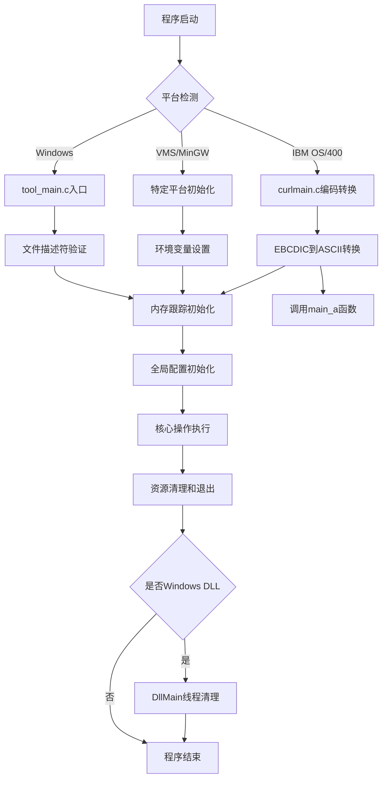
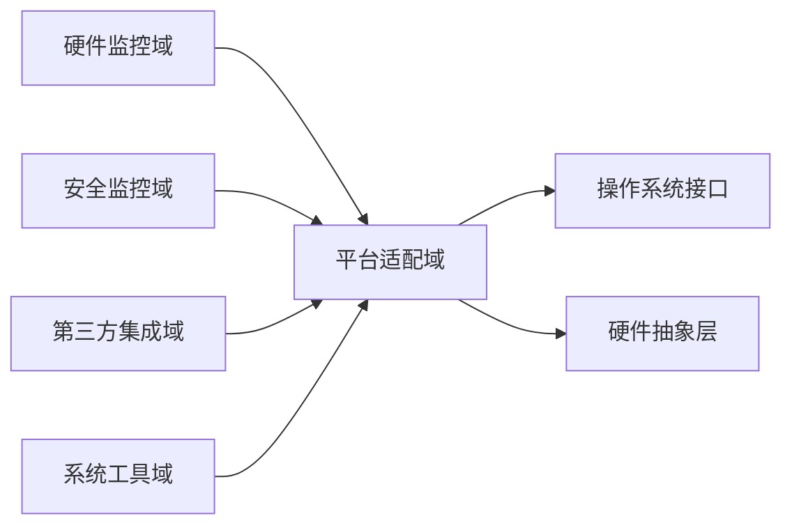

# SystemMonitorToolkit - 平台适配域技术实现文档

## 1. 概述

平台适配域是SystemMonitorToolkit系统的基础架构域，负责系统平台适配和基础架构支持。该域确保应用程序能够在不同环境下稳定运行，提供良好的兼容性支撑，是整个监控系统正常运行的基础保障。

### 1.1 域职责

- **操作系统信息管理**：获取和管理操作系统版本及平台信息
- **用户界面支撑**：为WPF用户界面提供基础架构支持
- **程序入口管理**：处理应用程序启动、初始化和生命周期控制
- **平台兼容性检测**：确保系统在不同平台环境下的正确运行

### 1.2 架构定位

平台适配域作为基础设施域，为以下核心业务域提供支撑：
- 为硬件监控域提供平台兼容性支撑
- 为安全监控域提供系统环境支持
- 为第三方集成域提供环境适配能力

## 2. 模块组成

### 2.1 系统信息子模块

**文件位置**：`src/core/os/OSInfo.cpp`、`src/core/os/OSInfo.h`

#### 2.1.1 功能描述

系统信息子模块专门负责获取和管理操作系统版本信息，为系统监控提供准确的环境基础信息。

#### 2.1.2 技术实现

**核心实现机制**：
```cpp
// 使用动态加载方式获取RtlGetVersion函数
typedef NTSTATUS(WINAPI* RtlGetVersionPtr)(PRTL_OSVERSIONINFOW);

OSInfo::OSInfo() {
    RTL_OSVERSIONINFOW osvi = { sizeof(osvi) };
    
    // 动态获取RtlGetVersion函数指针
    HMODULE ntdll = GetModuleHandleW(L"ntdll.dll");
    if (ntdll) {
        RtlGetVersionPtr RtlGetVersion = (RtlGetVersionPtr)GetProcAddress(ntdll, "RtlGetVersion");
        if (RtlGetVersion && RtlGetVersion(&osvi) == STATUS_SUCCESS) {
            // 构造详细的版本信息字符串
            osVersion = WinUtils::WstringToString(
                std::wstring(L"Windows ") + 
                std::to_wstring(osvi.dwMajorVersion) + L"." + 
                std::to_wstring(osvi.dwMinorVersion) + 
                L" (Build " + std::to_wstring(osvi.dwBuildNumber) + L")"
            );
        }
    }
}
```

**关键技术特点**：
- **动态API加载**：通过`GetProcAddress`动态获取`RtlGetVersion`函数指针
- **版本信息完整性**：提供主版本号、次版本号和构建号的完整信息
- **错误处理机制**：在API调用失败时提供兜底信息
- **字符编码转换**：利用WinUtils工具类进行宽字符到多字节字符的转换

#### 2.1.3 接口设计

```cpp
class OSInfo {
public:
    OSInfo();
    std::string GetVersion() const;
    
private:
    std::string osVersion;
};
```

### 2.2 程序入口管理子模块

**文件位置**：
- `src/third_party/curl/src/tool_main.c`
- `src/third_party/curl/packages/OS400/curlmain.c`
- `src/third_party/curl/lib/dllmain.c`

#### 2.2.1 功能描述

程序入口管理子模块是跨平台的程序启动基础组件，负责应用程序的入口点管理和生命周期控制，确保应用程序能够在各种环境下正确初始化、运行和清理资源。

#### 2.2.2 技术实现

**多平台适配技术**：
```c
#if defined(_WIN32)
    // Windows特定处理
    #include <windows.h>
#elif defined(__OS400__)
    // IBM OS/400特定处理
    #include "os400sys.h"
#elif defined(__VMS) || defined(__MINGW32__)
    // VMS/MinGW特定处理
    #include <unistd.h>
#endif
```

**字符编码转换机制**（针对IBM OS/400）：
```c
#ifdef __OS400__
    // EBCDIC到ASCII的两阶段转换
    // 第一阶段：测量转换长度
    size_t convert_length = convert_length_ebcdic_to_ascii(input);
    
    // 第二阶段：执行实际转换
    char* ascii_output = malloc(convert_length + 1);
    convert_ebcdic_to_ascii(input, ascii_output, convert_length);
#endif
```

**资源生命周期管理**：
```c
// 文件描述符验证
void validate_file_descriptors() {
    if (isatty(STDIN_FILENO) || isatty(STDOUT_FILENO) || isatty(STDERR_FILENO)) {
        // 标准I/O正常
    }
}

// 内存跟踪初始化
#ifdef CURL_MEMDEBUG
    if (getenv("CURL_MEMDEBUG")) {
        init_memory_tracking();
    }
#endif
```

**动态链接技术**（Windows平台）：
```c
#ifdef _WIN32
BOOL APIENTRY DllMain(HMODULE hModule, DWORD ul_reason_for_call, LPVOID lpReserved) {
    switch (ul_reason_for_call) {
        case DLL_PROCESS_ATTACH:
            // 进程附加时的初始化
            break;
        case DLL_THREAD_DETACH:
            // 线程分离时的清理
            OPENSSL_thread_stop();
            break;
        case DLL_PROCESS_DETACH:
            // 进程分离时的清理
            cleanup_resources();
            break;
    }
    return TRUE;
}
#endif
```

#### 2.2.3 启动流程



### 2.3 用户界面支撑子模块

**文件位置**：`WPF-UI1/`

#### 2.3.1 功能描述

用户界面支撑子模块负责WPF用户界面的构建和配置管理，为系统监控提供直观的数据可视化界面。

#### 2.3.2 技术实现

**核心功能组件**：
- **UI组件管理**：管理WPF界面控件的创建和生命周期
- **数据转换处理**：将底层监控数据转换为UI可显示的格式
- **服务层封装**：封装共享内存访问服务
- **视图模型管理**：实现MVVM模式的视图模型层

## 3. 关键技术实现

### 3.1 条件编译机制

平台适配域采用条件编译技术实现跨平台支持：

```c
#if defined(_WIN32)
    #define PLATFORM_SPECIFIC_CODE windows_code()
#elif defined(__linux__)
    #define PLATFORM_SPECIFIC_CODE linux_code()
#elif defined(__APPLE__)
    #define PLATFORM_SPECIFIC_CODE macos_code()
#else
    #define PLATFORM_SPECIFIC_CODE generic_code()
#endif
```

### 3.2 动态库加载技术

对于系统API的调用采用动态加载方式，提高兼容性：

```cpp
// 动态获取系统函数指针
HMODULE hModule = GetModuleHandleW(L"ntdll.dll");
if (hModule) {
    auto funcPtr = GetProcAddress(hModule, "FunctionName");
    if (funcPtr) {
        // 调用函数
    }
}
```

### 3.3 资源管理策略

**内存管理**：
- 支持内存跟踪调试模式
- 自动资源清理机制
- 线程安全的内存分配

**文件描述符管理**：
- 启动时验证标准I/O描述符
- 确保文件资源正确关闭

## 4. 与其他域的交互

### 4.1 依赖关系



### 4.2 接口调用

**为硬件监控域提供**：
- 操作系统版本信息
- 平台兼容性检测
- 系统环境配置

**为第三方集成域提供**：
- 平台特定的初始化
- 环境适配支持
- 资源管理接口

## 5. 配置与部署

### 5.1 编译配置

平台适配域支持多种编译配置：

```cmake
# 平台检测
if(WIN32)
    set(PLATFORM_SOURCES windows_specific.cpp)
elseif(APPLE)
    set(PLATFORM_SOURCES macos_specific.cpp)
elseif(UNIX)
    set(PLATFORM_SOURCES unix_specific.cpp)
endif()

# 条件编译选项
option(ENABLE_MEMORY_DEBUG "Enable memory debugging" OFF)
option(ENABLE_PLATFORM_LOGGING "Enable platform-specific logging" ON)
```

### 5.2 运行时配置

**环境变量支持**：
- `CURL_MEMDEBUG`：启用内存调试
- `PLATFORM_LOG_LEVEL`：设置日志级别
- `SKIP_PLATFORM_CHECK`：跳过平台兼容性检查

## 6. 故障排查与维护

### 6.1 常见问题

**平台检测失败**：
- 检查预处理器宏定义
- 验证编译器平台支持
- 确认运行时环境匹配

**资源泄漏**：
- 启用内存调试模式
- 检查文件描述符状态
- 验证线程清理逻辑

### 6.2 调试支持

**日志配置**：
```cpp
// 平台特定的日志记录
#ifdef _WIN32
    OutputDebugStringA(message.c_str());
#else
    syslog(LOG_INFO, "%s", message.c_str());
#endif
```

**诊断工具**：
- 平台信息检测工具
- 资源使用监控
- 兼容性测试套件

## 7. 性能优化

### 7.1 启动优化

- **延迟加载**：非关键组件延迟初始化
- **缓存机制**：平台信息缓存避免重复获取
- **并行初始化**：独立组件并行启动

### 7.2 内存优化

- **对象池**：频繁创建销毁的对象使用对象池
- **内存池**：预分配内存块减少分配开销
- **智能指针**：自动管理对象生命周期

## 8. 扩展性设计

### 8.1 新平台支持

添加新平台支持的步骤：
1. 在条件编译中添加平台标识
2. 实现平台特定的初始化代码
3. 添加平台相关的测试用例
4. 更新文档和配置文件

### 8.2 功能扩展

平台适配域支持以下扩展：
- 新的系统信息获取接口
- 额外的平台适配逻辑
- 自定义的资源管理策略

---

**文档版本**：1.0  
**最后更新**：2024年  
**维护团队**：SystemMonitorToolkit开发组