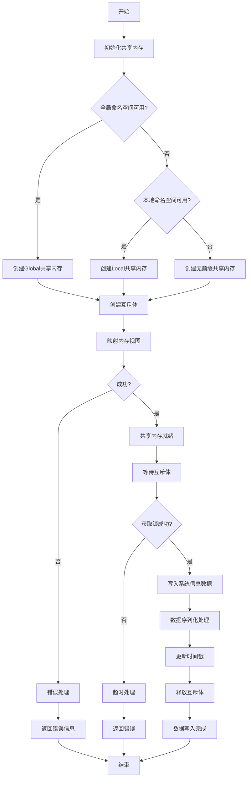
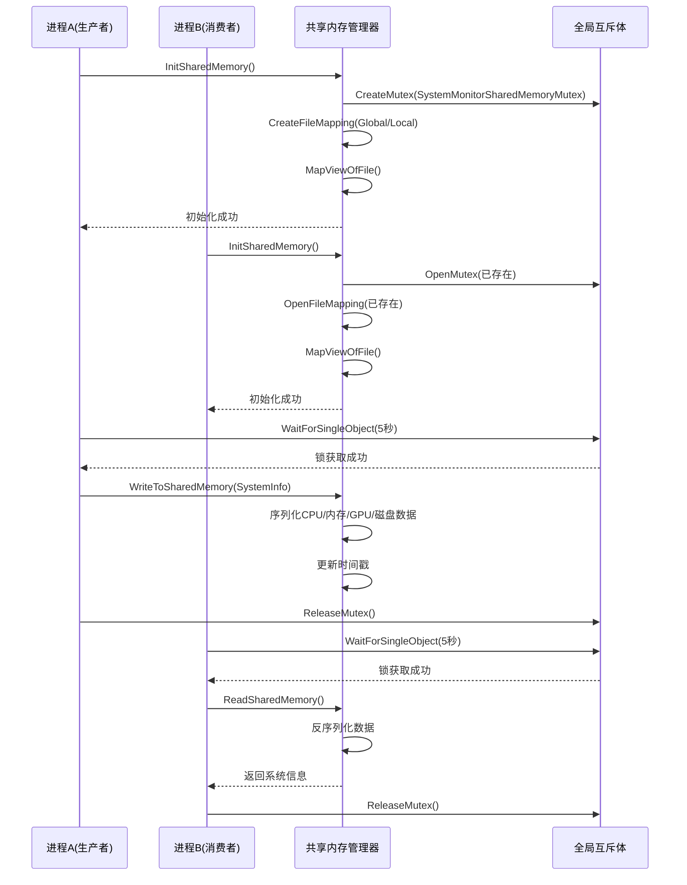
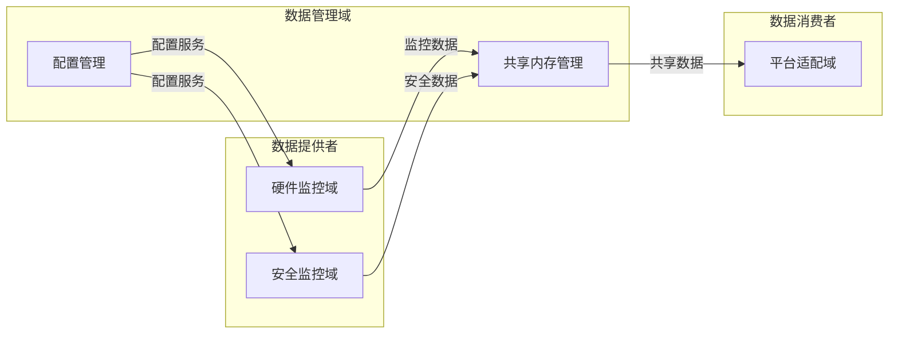

# 数据管理域技术实现文档

## 1. 概述

数据管理域是SystemMonitorToolkit系统的基础设施域，负责系统监控数据的结构化管理、存储和跨进程共享。该领域确保数据的一致性、完整性和可访问性，为监控数据的持久化和多进程协作提供基础支撑。

### 1.1 领域定位
- **领域类型**：基础设施域
- **重要性等级**：8.0/10
- **复杂度等级**：7.0/10
- **核心职责**：数据结构管理、跨进程数据共享、配置参数管理

### 1.2 架构组成
数据管理域包含以下关键子模块：

```
数据管理域
├── 共享内存管理子模块 (重要性: 9.0)
│   ├── SharedMemoryManager.cpp
│   ├── SharedMemoryManager.h
│   └── Producer.cpp
└── 配置管理子模块 (重要性: 7.0)
    └── config2setopts.c (集成自第三方库)
```

## 2. 核心子模块详解

### 2.1 共享内存管理子模块

#### 2.1.1 模块概述
共享内存管理子模块是数据管理域的核心组件，专门负责Windows平台下跨进程共享内存区域的创建和管理。该组件为系统监控数据的实时共享提供高效、安全的基础设施。

#### 2.1.2 技术架构

**核心类结构**：
```cpp
class SharedMemoryManager {
private:
    static HANDLE hMapFile;                    // 文件映射句柄
    static SharedMemoryBlock* pBuffer;         // 共享内存缓冲区指针
    static std::string lastError;              // 错误信息存储
    
public:
    static bool InitSharedMemory();            // 初始化共享内存
    static bool WriteToSharedMemory(const SystemInfo& systemInfo); // 写入数据
    static void CleanupSharedMemory();         // 清理资源
    static std::string GetLastError();         // 获取错误信息
};
```

#### 2.1.3 技术实现细节

**1. 共享内存创建机制**

```cpp
// 安全属性配置
SECURITY_ATTRIBUTES securityAttributes;
SECURITY_DESCRIPTOR securityDescriptor;

// 初始化安全描述符
InitializeSecurityDescriptor(&securityDescriptor, SECURITY_DESCRIPTOR_REVISION);
SetSecurityDescriptorDacl(&securityDescriptor, TRUE, NULL, FALSE);

// 创建文件映射对象
hMapFile = CreateFileMapping(
    INVALID_HANDLE_VALUE,
    &securityAttributes,
    PAGE_READWRITE,
    0,
    sizeof(SharedMemoryBlock),
    L"Global\\SystemMonitorSharedMemory"
);
```

**关键技术特点**：
- 支持`Global\\`、`Local\\`和无前缀三种命名空间的降级处理
- 使用`SECURITY_ATTRIBUTES`和`SECURITY_DESCRIPTOR`实现细粒度权限控制
- 设置`PAGE_READWRITE`属性支持读写访问
- 启用`SeCreateGlobalPrivilege`权限支持全局对象创建

**2. 跨进程同步机制**

```cpp
// 全局互斥体创建
static HANDLE g_hMutex = CreateMutexW(NULL, FALSE, 
    L"Global\\SystemMonitorSharedMemoryMutex");

// 互斥访问控制
DWORD waitResult = WaitForSingleObject(g_hMutex, 5000); // 5秒超时
if (waitResult == WAIT_OBJECT_0) {
    // 执行数据写入操作
    WriteDataToSharedMemory();
    ReleaseMutex(g_hMutex);
}
```

**同步机制特点**：
- 使用全局命名互斥体实现多进程同步
- 支持5秒超时的互斥等待机制
- 通过`ReleaseMutex`确保锁的释放，避免死锁
- 异常安全的资源管理模式

**3. 数据序列化处理**

```cpp
// 安全字符串拷贝模板
template<size_t N>
void SafeCopyWideString(const std::wstring& source, wchar_t(&dest)[N]) {
    size_t copyLength = std::min(source.length(), N - 1);
    if (copyLength > 0) {
        wmemcpy(dest, source.c_str(), copyLength);
    }
    dest[copyLength] = L'\0';
}

// 复杂数据结构序列化
void SerializeSystemInfo(const SystemInfo& systemInfo) {
    // CPU信息序列化
    SafeCopyWideString(systemInfo.cpu.brand, pBuffer->cpu.brand);
    pBuffer->cpu.usage = systemInfo.cpu.usage;
    
    // 内存信息序列化
    pBuffer->memory.total = systemInfo.memory.total;
    pBuffer->memory.available = systemInfo.memory.available;
    
    // GPU信息序列化
    for (size_t i = 0; i < systemInfo.gpus.size() && i < MAX_GPUS; ++i) {
        SafeCopyWideString(systemInfo.gpus[i].name, 
                          pBuffer->gpus[i].name);
        pBuffer->gpus[i].temperature = systemInfo.gpus[i].temperature;
    }
}
```

**序列化特点**：
- 实现了`SafeCopyWideString`模板函数处理字符串安全拷贝
- 支持Unicode字符串到宽字符数组的转换
- 采用`SafeCopyFromWideArray`处理数组类型数据
- 实现复杂数据结构的扁平化处理

#### 2.1.4 工作流程



#### 2.1.5 跨进程交互序列图



#### 2.1.6 性能优化特性

1. **直接内存映射访问**：避免数据拷贝开销，提供零拷贝的数据访问
2. **预分配固定大小**：共享内存区域预分配，避免动态内存分配
3. **增量数据更新**：支持部分数据更新，减少不必要的重写操作
4. **内存对齐优化**：数据结构按内存对齐原则设计，提高访问效率

### 2.2 配置管理子模块

#### 2.2.1 模块概述
配置管理子模块负责系统配置参数的管理和转换，集成自libcurl库的配置处理功能，为应用程序提供灵活的配置管理能力。

#### 2.2.2 核心功能

**主要功能**：
- 配置参数解析和转换
- 多协议配置支持
- SSL/TLS配置管理
- 命令行选项处理

**技术特点**：
- 基于libcurl的成熟配置管理机制
- 支持多种配置格式和协议
- 提供配置验证和错误处理
- 集成网络传输相关配置

## 3. 数据管理域与外部系统的交互

### 3.1 领域间依赖关系



### 3.2 关键接口定义

**1. 数据写入接口**
```cpp
bool WriteToSharedMemory(const SystemInfo& systemInfo);
```
- **功能**：将完整的系统信息数据写入共享内存
- **参数**：systemInfo - 包含所有监控数据的结构体
- **返回**：成功返回true，失败返回false

**2. 初始化接口**
```cpp
bool InitSharedMemory();
```
- **功能**：初始化共享内存区域和相关同步机制
- **返回**：成功返回true，失败返回false

**3. 资源清理接口**
```cpp
void CleanupSharedMemory();
```
- **功能**：清理共享内存相关资源
- **特点**：异常安全，确保资源正确释放

## 4. 错误处理与异常管理

### 4.1 错误处理机制

**1. Windows错误码处理**
```cpp
DWORD errorCode = ::GetLastError();
std::stringstream ss;
ss << "操作失败，错误码: " << errorCode 
   << " (" << WinUtils::FormatWindowsErrorMessage(errorCode) << ")";
lastError = ss.str();
Logger::Error(lastError);
```

**2. 异常安全设计**
- RAII模式管理资源生命周期
- 自动清理机制确保资源释放
- 异常情况下的状态回滚

### 4.2 日志记录策略

- **错误级别**：记录所有关键错误和异常
- **警告级别**：记录非关键问题和降级操作
- **信息级别**：记录重要状态变化和操作结果
- **调试级别**：记录详细的执行流程

## 5. 性能与安全特性

### 5.1 性能特性

1. **零拷贝数据传输**：通过内存映射实现直接数据访问
2. **高效同步机制**：使用互斥体确保数据一致性，避免竞争条件
3. **内存预分配**：固定大小的共享内存区域，避免动态分配开销
4. **批量数据更新**：支持一次更新多个监控指标

### 5.2 安全特性

1. **权限控制**：通过安全描述符控制访问权限
2. **数据完整性**：互斥机制确保数据写入的原子性
3. **内存安全**：边界检查防止缓冲区溢出
4. **异常安全**：完整的错误处理和资源清理机制

## 6. 部署与维护

### 6.1 部署要求

**系统要求**：
- Windows平台支持
- 管理员权限（用于创建全局共享内存）
- 足够的系统内存用于共享内存分配

**依赖项**：
- Windows API支持
- 系统工具域的Logger和WinUtils组件
- WMI管理器（用于系统信息获取）

### 6.2 维护要点

1. **监控共享内存使用情况**：定期检查内存使用率和性能指标
2. **日志分析**：通过日志记录监控系统运行状态
3. **错误处理**：及时处理和报告系统错误
4. **资源清理**：确保进程退出时正确清理共享内存资源

## 7. 扩展性设计

### 7.1 可扩展架构

1. **模块化设计**：各子模块独立，便于单独扩展
2. **接口标准化**：统一的接口设计支持功能扩展
3. **配置驱动**：通过配置文件控制功能和行为
4. **插件机制**：支持第三方监控数据的集成

### 7.2 未来扩展方向

1. **多平台支持**：扩展支持Linux/macOS平台
2. **分布式共享**：支持网络环境下的数据共享
3. **数据压缩**：添加数据压缩功能减少内存占用
4. **加密传输**：支持敏感数据的加密存储和传输

---

**文档版本**：1.0  
**生成时间**：2025-10-30 12:39:24 UTC  
**维护团队**：SystemMonitorToolkit开发组