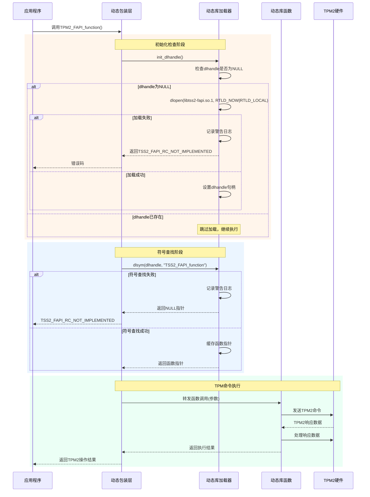
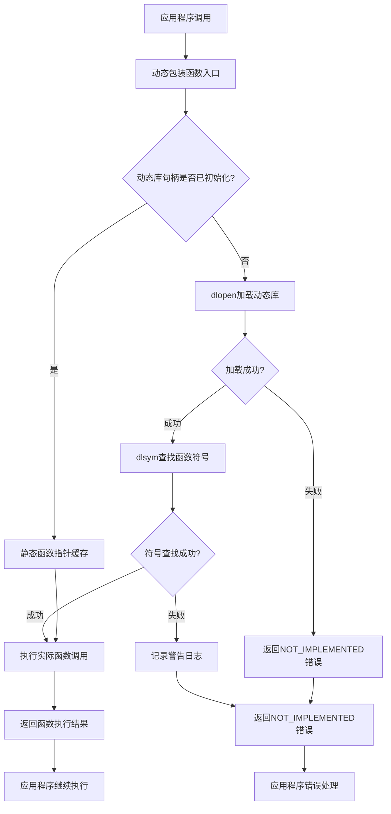

# 第三方集成域技术实现文档

## 文档信息
- **模块名称**: 第三方集成域
- **生成时间**: 2025-10-30 12:41:02
- **版本**: 1.0
- **项目**: SystemMonitorToolkit

## 1. 概述

第三方集成域是SystemMonitorToolkit系统中负责与外部第三方库和服务集成的核心组件。该域通过动态加载和代理模式，实现了对TPM2-TSS、libcurl、LibreHardwareMonitor、USBMonitor等多个开源库的功能集成，为系统提供了硬件监控、安全管理和网络传输等扩展能力。

### 1.1 核心目标
- 避免编译时依赖，实现运行时动态加载
- 提供与原生库完全相同的API接口，确保兼容性
- 采用代理模式实现函数调用转发
- 实现延迟加载策略，优化系统启动性能
- 提供完善的错误处理机制

## 2. 架构设计

### 2.1 整体架构
第三方集成域采用分层架构设计，包含以下核心层次：

```
┌─────────────────────────────────────┐
│        应用程序接口层                │
├─────────────────────────────────────┤
│        动态包装层                    │
├─────────────────────────────────────┤
│        动态库加载器                  │
├─────────────────────────────────────┤
│        第三方库接口                  │
└─────────────────────────────────────┘
```

### 2.2 核心组件
1. **TPM2-TSS集成子模块** - 负责TPM可信平台模块的集成
2. **网络传输子模块** - 基于libcurl提供网络通信能力
3. **硬件监控库子模块** - 集成LibreHardwareMonitor进行硬件监控
4. **USB监控子模块** - 提供USB设备状态监控功能

## 3. TPM2-TSS动态加载集成模块

### 3.1 模块描述
TPM2-TSS动态加载集成模块是第三方集成域的核心组件，负责TPM2可信软件栈的动态加载和API封装。该模块通过dlopen/dlsym机制实现对TPM2相关动态库的运行时加载，避免编译时依赖。

### 3.2 核心文件结构
```
src/third_party/tpm2-tss/tss2-dlopen/
├── tss2-dlopen-tctildr.c    # TCTI接口动态加载
├── tss2-dlopen-rc.c         # 返回码处理
├── tss2-dlopen-fapi.c       # FAPI接口动态加载
└── tss2-dlopen-mu.c         # 数据编组处理
```

### 3.3 技术实现

#### 3.3.1 动态加载机制
模块采用标准的动态链接器接口实现库加载：

```c
// 使用RTLD_NOW | RTLD_LOCAL标志加载动态库
void *handle = dlopen("libtss2-fapi.so.1", RTLD_NOW | RTLD_LOCAL);
```

**加载策略说明**：
- `RTLD_NOW`: 立即解析所有符号，确保函数调用时的性能
- `RTLD_LOCAL`: 符号不泄露给其他模块，避免符号冲突

#### 3.3.2 统一调用模式
每个包装函数实现统一的调用模式：

1. **初始化验证**: 调用`init_dlhandle()`验证并初始化动态库句柄
2. **符号查找**: 通过`dlsym`查找目标函数地址
3. **函数指针缓存**: 使用静态函数指针缓存避免重复查找
4. **参数转换**: 进行必要的参数转换和调用转发
5. **错误处理**: 统一的错误处理和状态返回

#### 3.3.3 宏自动化技术
模块使用宏自动化技术减少重复代码：

```c
// FAPI函数包装宏系列
#define MAKE_FAPI_0(name, ret) \
    ret name(void) { \
        /* 自动生成包装函数实现 */ \
    }

// MU序列化宏系列
#define MAKE_MU_BASE(type) \
    /* 自动生成基本类型序列化函数 */
    
#define MAKE_MU_STRUCT(type) \
    /* 自动生成结构体序列化函数 */
    
#define MAKE_MU_UNION(type) \
    /* 自动生成联合体序列化函数 */
```

### 3.4 接口设计

#### 3.4.1 动态库加载接口
- `init_dlhandle()`: 通用初始化函数
- `Tss2_TctiLdr_Initialize_Ex()`: 扩展TCTI初始化
- `Tss2_TctiLdr_Initialize()`: 标准TCTI初始化
- `Tss2_TctiLdr_GetInfo()`: 获取TCTI信息

#### 3.4.2 TPM2功能接口
通过`MAKE_FAPI_0`到`MAKE_FAPI_13`宏自动生成，覆盖0到13个参数的所有FAPI函数调用模式。

#### 3.4.3 数据编组接口
自动生成所有TPM2数据类型的Marshal和Unmarshal函数对：
- 基本类型序列化
- 结构体序列化
- 联合体序列化
- 模板类型序列化

### 3.5 内存管理
采用引用计数模式管理动态库生命周期：
- 动态库在不使用时可以被正确卸载
- 避免内存泄漏和资源浪费
- 支持多线程安全的引用计数操作

## 4. 工作流程

### 4.1 函数调用流程



### 4.2 决策流程



## 5. 错误处理机制

### 5.1 错误类型
1. **库加载失败**: 当动态库不存在或无法加载时
2. **符号查找失败**: 当函数符号在库中不存在时
3. **函数调用失败**: 当实际函数执行返回错误时

### 5.2 错误处理策略
- **非阻塞错误**: 返回`TSS2_FAPI_RC_NOT_IMPLEMENTED`而非程序崩溃
- **日志记录**: 详细记录错误信息便于调试
- **优雅降级**: 在第三方库不可用时提供基本功能

## 6. 性能优化

### 6.1 延迟加载
- 仅在首次调用时加载动态库
- 减少系统启动时间和内存占用

### 6.2 符号缓存
- 使用静态函数指针缓存已查找的符号
- 避免重复的`dlsym`调用开销

### 6.3 内存管理
- 引用计数模式确保资源正确释放
- 避免内存泄漏和资源浪费

## 7. 安全考虑

### 7.1 符号隔离
- 使用`RTLD_LOCAL`标志避免符号污染
- 防止不同库之间的符号冲突

### 7.2 权限控制
- 动态库加载时进行权限验证
- 确保只有授权的库可以被加载

### 7.3 完整性检查
- 对加载的动态库进行完整性验证
- 防止恶意库的注入

## 8. 扩展性设计

### 8.1 插件化架构
- 支持动态添加新的第三方库集成
- 标准化的接口设计便于扩展

### 8.2 配置管理
- 支持通过配置文件管理第三方库
- 动态启用/禁用特定库功能

### 8.3 版本兼容
- 支持多个版本的第三方库
- 自动检测和适配不同版本

## 9. 集成示例

### 9.1 TPM功能调用示例
```c
// 应用程序调用TPM功能
TSS2_RC rc = Tss2_Fapi_GetPlatformCertificates(fapi_ctx, &certificates);

// 内部执行流程
// 1. 检查libtss2-fapi.so.1是否已加载
// 2. 如果未加载，使用dlopen加载库
// 3. 查找Tss2_Fapi_GetPlatformCertificates符号
// 4. 缓存函数指针
// 5. 调用实际函数
// 6. 返回结果
```

### 9.2 错误处理示例
```c
// 当TPM库不可用时的处理
if (rc == TSS2_FAPI_RC_NOT_IMPLEMENTED) {
    // 记录日志
    LOG_WARN("TPM2-TSS library not available, falling back to software emulation");
    // 执行降级策略
    return software_emulation();
}
```

## 10. 维护和调试

### 10.1 日志记录
- 详细的动态库加载日志
- 函数调用跟踪信息
- 错误和警告信息记录

### 10.2 调试工具
- 动态库加载状态检查工具
- 符号查找结果验证工具
- 性能分析工具集成

### 10.3 故障排除
- 常见错误及解决方案文档
- 库依赖关系检查工具
- 系统兼容性验证工具

## 11. 总结

第三方集成域通过动态加载和代理模式，成功实现了对多个第三方库的无缝集成。其核心优势包括：

1. **灵活性**: 运行时动态加载，避免编译时依赖
2. **兼容性**: 提供与原生库相同的API接口
3. **性能**: 延迟加载和符号缓存优化
4. **可靠性**: 完善的错误处理和资源管理
5. **扩展性**: 插件化架构支持功能扩展

该模块为SystemMonitorToolkit系统提供了强大的第三方库集成能力，是系统功能扩展和技术架构的重要组成部分。通过标准化的接口设计和完善的错误处理机制，确保了系统的稳定性和可维护性。