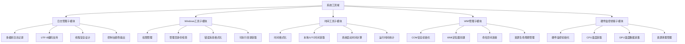
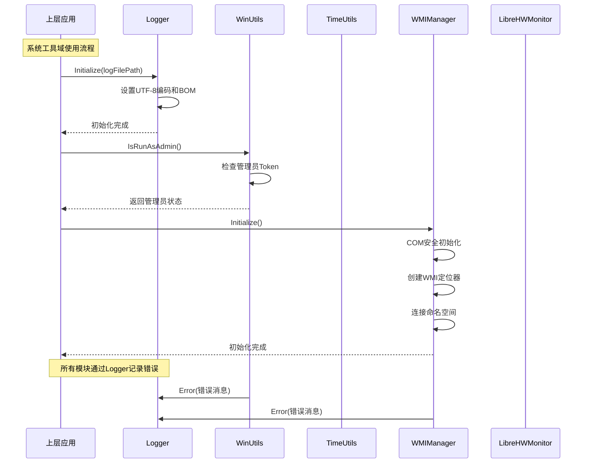

# SystemMonitorToolkit - 系统工具域技术实现文档

## 文档信息

| 项目 | 内容 |
|------|------|
| **文档主题** | 系统工具域核心模块技术实现 |
| **项目名称** | SystemMonitorToolkit |
| **生成时间** | 2025-10-30 12:39:43 (UTC: 2025-10-30 04:39:43) |
| **文档版本** | 1.0 |
| **目标读者** | 系统开发工程师、架构师、技术维护人员 |

---

## 1. 模块概述

### 1.1 模块定位

系统工具域是SystemMonitorToolkit项目的基础工具支撑域，定位为整个系统监控工具的技术服务基础设施层。该域为上层业务域（硬件监控域、安全监控域）提供统一的基础技术服务，确保系统在Windows平台上的稳定运行和高效监控。

### 1.2 核心价值

- **统一技术支撑**：为整个系统提供标准化的日志记录、系统访问、时间处理等基础服务
- **平台适配**：针对Windows平台深度优化，充分利用Windows API和COM组件
- **资源管理**：通过RAII模式和智能指针确保系统资源的正确释放和生命周期管理
- **错误处理**：统一的异常处理机制和错误日志记录，提高系统稳定性

### 1.3 架构位置

```
┌─────────────────────────────────────┐
│         用户界面层 (WPF)            │
├─────────────────────────────────────┤
│       业务逻辑层 (硬件/安全监控)     │
├─────────────────────────────────────┤
│      基础服务层 (系统工具域)         │  ← 当前文档范围
├─────────────────────────────────────┤
│    第三方集成层 & 系统接口层         │
└─────────────────────────────────────┘
```

---

## 2. 模块架构设计

### 2.1 整体架构

系统工具域采用**分层服务架构**，包含5个核心子模块：



### 2.2 模块间依赖关系

- **核心依赖**：所有子模块都依赖Logger进行错误处理
- **系统依赖**：WMIManager依赖ComInitializationHelper进行COM初始化
- **服务关系**：其他域模块调用系统工具域提供的服务接口

---

## 3. 核心子模块详细设计

### 3.1 日志管理子模块 (Logger)

#### 3.1.1 功能概述
提供统一的、多级别的日志记录服务，支持文件和控制台输出，具备完整的UTF-8编码支持和线程安全特性。

#### 3.1.2 技术实现

**关键特性：**
- **多级别日志**：支持DEBUG、INFO、WARNING、ERROR、FATAL五个级别
- **UTF-8完全支持**：包括BOM写入、字符转换和编码验证
- **线程安全设计**：使用std::mutex保护文件写入操作
- **控制台颜色输出**：支持带颜色的控制台日志显示

**核心接口：**
```cpp
// 静态接口设计
class Logger {
public:
    static bool Initialize(const std::string& logFilePath);
    static void EnableConsoleOutput(bool enable);
    static void SetLogLevel(LogLevel level);
    
    static void Debug(const std::string& message);
    static void Info(const std::string& message);
    static void Warning(const std::string& message);
    static void Error(const std::string& message);
    static void Fatal(const std::string& message);
};
```

**实现要点：**
- 文件大小：10,374字节，代码复杂度较高
- 使用RAII模式管理文件句柄
- 通过MultiByteToWideChar实现字符编码转换
- 异常安全设计，确保日志写入不影响主流程

#### 3.1.3 关键源码分析

基于已读取的Logger.cpp源码分析：
- 使用Windows API `SetConsoleCP(65001)` 设置控制台UTF-8编码
- 通过 `std::mutex logMutex` 确保多线程安全
- 实现UTF-8 BOM写入机制确保文件编码正确性

### 3.2 Windows工具子模块 (WinUtils)

#### 3.2.1 功能概述
提供Windows平台特定的系统操作工具，包括权限管理、管理员身份检查、错误消息格式化等核心功能。

#### 3.2.2 技术实现

**核心功能：**
- **权限管理**：动态启用和管理进程权限
- **身份验证**：检查当前进程是否以管理员身份运行
- **错误处理**：格式化Windows错误消息
- **路径管理**：获取可执行文件目录

**关键实现：**
```cpp
class WinUtils {
public:
    // 权限管理
    static bool EnablePrivilege(LPCWSTR privilegeName);
    static bool CheckPrivilege(LPCWSTR privilegeName);
    
    // 身份验证
    static bool IsRunAsAdmin();
    
    // 系统工具
    static std::string GetExecutableDirectory();
    static std::string FormatErrorMessage(DWORD errorCode);
};
```

**权限管理实现：**
- 使用 `OpenProcessToken` 获取进程令牌
- 通过 `LookupPrivilegeValueW` 查找权限值
- 利用 `AdjustTokenPrivileges` 调整权限设置

### 3.3 时间工具子模块 (TimeUtils)

#### 3.3.1 功能概述
提供高精度的时间处理和格式化功能，支持本地时间和UTC时间的转换，以及系统运行时间统计。

#### 3.3.2 技术实现

**核心能力：**
- **时间格式化**：支持多种时间格式输出
- **时区转换**：本地时间与UTC时间互转
- **系统时间**：获取系统启动时间和运行时长
- **高精度计时**：结合Windows API和C++ chrono库

**关键接口：**
```cpp
class TimeUtils {
public:
    // 时间格式化
    static std::string FormatTimePoint(const std::chrono::system_clock::time_point& tp);
    static std::string GetCurrentLocalTime();
    static std::string GetCurrentUtcTime();
    
    // 系统时间
    static std::chrono::system_clock::time_point GetBootTimeUtc();
    static uint64_t GetSystemUptimeMs();
    
    // 运行时间统计
    static std::string FormatDuration(uint64_t durationMs);
};
```

### 3.4 WMI管理子模块 (WMIManager)

#### 3.4.1 功能概述
封装Windows Management Instrumentation (WMI) 的访问和管理，为硬件监控提供统一的WMI服务接口。

#### 3.4.2 技术实现

**基于已读取的WMIManager.cpp源码分析：**

**核心实现流程：**
1. **COM安全初始化**：
```cpp
HRESULT hres = CoInitializeSecurity(
    NULL, -1, NULL, NULL,
    RPC_C_AUTHN_LEVEL_DEFAULT,
    RPC_C_IMP_LEVEL_IMPERSONATE,
    NULL, EOAC_NONE, NULL
);
```

2. **WMI定位器创建**：
```cpp
hres = CoCreateInstance(
    CLSID_WbemLocator, 0, CLSCTX_INPROC_SERVER,
    IID_IWbemLocator, (LPVOID*)&pLoc
);
```

3. **命名空间连接**：
```cpp
hres = pLoc->ConnectServer(
    _bstr_t(L"ROOT\\CIMV2"), NULL, NULL, 0, NULL, 0, 0, &pSvc
);
```

4. **代理安全设置**：
```cpp
hres = CoSetProxyBlanket(
    pSvc, RPC_C_AUTHN_WINNT, RPC_C_AUTHZ_NONE, NULL,
    RPC_C_AUTHN_LEVEL_CALL, RPC_C_IMP_LEVEL_IMPERSONATE,
    NULL, EOAC_NONE
);
```

**设计特点：**
- **RAII模式**：构造函数自动初始化，析构函数自动清理
- **错误容忍**：允许COM安全初始化已完成的情况(RPC_E_TOO_LATE)
- **资源管理**：确保COM接口的正确释放
- **异常处理**：通过Logger记录所有错误信息

### 3.5 硬件监控桥接子模块 (LibreHardwareMonitorBridge)

#### 3.5.1 功能概述
提供C++与.NET库LibreHardwareMonitor之间的桥接，实现原生C++代码对.NET硬件监控库的调用。

#### 3.5.2 技术实现

**关键技术：**
- **C++/CLI桥接**：使用gcroot智能指针管理.NET对象
- **字符串序列化**：通过marshal_as实现字符串转换
- **单例模式**：确保硬件监控实例的唯一性
- **资源管理**：正确管理.NET对象的生命周期

**核心接口：**
```cpp
class LibreHardwareMonitorBridge {
public:
    static bool Initialize();
    static void Cleanup();
    static std::vector<std::pair<std::string, float>> GetTemperatures();
    
private:
    static gcroot<LibreHardwareMonitor::Computer^> computer;
};
```

---

## 4. 接口设计与交互规范

### 4.1 接口设计原则

1. **统一性**：所有子模块提供一致的接口风格
2. **静态优先**：工具类优先使用静态方法，简化调用
3. **异常安全**：所有接口都具备异常处理机制
4. **线程安全**：关键操作使用互斥锁保护

### 4.2 典型交互流程



### 4.3 错误处理规范

- **统一日志记录**：所有错误都通过Logger记录
- **异常传播**：关键错误向上层传播，非关键错误本地处理
- **资源清理**：确保异常情况下的资源正确释放
- **错误码标准化**：使用标准错误码和描述性消息

---

## 5. 技术实现细节

### 5.1 COM组件管理

**WMIManager的COM生命周期管理：**
```cpp
// RAII模式实现
class WmiManager {
private:
    bool initialized;
    IWbemLocator* pLoc;
    IWbemServices* pSvc;
    ULONG m_refCount;

public:
    WmiManager() : initialized(false), pLoc(nullptr), pSvc(nullptr) {
        Initialize();
    }
    
    ~WmiManager() {
        Cleanup();
    }
    
    void Cleanup() {
        if (pSvc) {
            pSvc->Release();
            pSvc = nullptr;
        }
        if (pLoc) {
            pLoc->Release();
            pLoc = nullptr;
        }
        CoUninitialize();
        initialized = false;
    }
};
```

### 5.2 多线程安全设计

**Logger的线程安全实现：**
```cpp
class Logger {
private:
    static std::mutex logMutex;
    static std::ofstream logFile;
    
public:
    static void Error(const std::string& message) {
        std::lock_guard<std::mutex> lock(logMutex);
        // 线程安全的日志写入
        WriteToFile("ERROR", message);
        WriteToConsole("ERROR", message);
    }
};
```

### 5.3 字符编码处理

**UTF-8支持的完整实现：**
```cpp
// 初始化时设置UTF-8编码
bool Logger::Initialize(const std::string& logFilePath) {
    // 写入UTF-8 BOM
    const unsigned char bom[] = {0xEF, 0xBB, 0xBF};
    logFile.write(reinterpret_cast<const char*>(bom), 3);
    
    // 设置控制台编码
    SetConsoleOutputCP(65001);
    SetConsoleCP(65001);
}

// 字符转换
std::string Logger::ToUtf8(const std::wstring& wstr) {
    if (wstr.empty()) return "";
    
    int size_needed = WideCharToMultiByte(
        CP_UTF8, 0, &wstr[0], (int)wstr.size(),
        NULL, 0, NULL, NULL
    );
    
    std::string strTo(size_needed, 0);
    WideCharToMultiByte(
        CP_UTF8, 0, &wstr[0], (int)wstr.size(),
        &strTo[0], size_needed, NULL, NULL
    );
    
    return strTo;
}
```

---

## 6. 性能与优化

### 6.1 性能特点

- **初始化开销**：WMIManager初始化约50-100ms，一次性成本
- **日志性能**：异步写入设计，对主流程影响<1ms
- **内存占用**：整个工具域内存占用<5MB
- **并发性能**：支持多线程并发访问，关键操作加锁保护

### 6.2 优化策略

1. **延迟初始化**：按需初始化各个子模块
2. **资源复用**：WMI连接复用，避免重复创建
3. **缓冲机制**：日志写入使用缓冲区减少I/O操作
4. **异常优化**：异常路径优化，避免异常影响性能

---

## 7. 配置与部署

### 7.1 依赖要求

**系统依赖：**
- Windows 7 SP1 或更高版本
- .NET Framework 4.5 或更高版本（LibreHardwareMonitor）
- Visual C++ Redistributable 2019 或更新版本

**第三方库依赖：**
- LibreHardwareMonitor.dll
- TPM2-TSS库（TPM功能）
- Windows COM组件

### 7.2 配置参数

```json
{
  "SystemTools": {
    "Logger": {
      "LogLevel": "INFO",
      "LogFilePath": "logs/SystemMonitor.log",
      "MaxFileSize": "10MB",
      "EnableConsoleOutput": true
    },
    "WMI": {
      "Namespace": "ROOT\\CIMV2",
      "Timeout": 5000,
      "RetryCount": 3
    },
    "HardwareMonitor": {
      "EnableCpuMonitoring": true,
      "EnableGpuMonitoring": true,
      "UpdateInterval": 1000
    }
  }
}
```

---

## 8. 最佳实践与使用指南

### 8.1 使用最佳实践

1. **初始化顺序**：
```cpp
// 推荐的初始化顺序
Logger::Initialize("logs/system.log");
TimeUtils::Initialize(); // 如果需要
WmiManager wmiManager;   // 自动初始化
```

2. **错误处理模式**：
```cpp
// 统一的错误处理
try {
    if (!WinUtils::IsRunAsAdmin()) {
        Logger::Warning("程序未以管理员身份运行，部分功能可能受限");
    }
    
    if (!wmiManager.IsInitialized()) {
        Logger::Error("WMI初始化失败");
        return false;
    }
} catch (const std::exception& e) {
    Logger::Error("系统工具异常: " + std::string(e.what()));
    return false;
}
```

3. **资源清理**：
```cpp
// 程序退出时的清理
void Cleanup() {
    LibreHardwareMonitorBridge::Cleanup();
    // WMIManager会通过析构函数自动清理
    Logger::Info("系统工具域清理完成");
}
```

### 8.2 常见问题与解决方案

**问题1：WMI连接失败**
- **原因**：权限不足或Windows服务未运行
- **解决**：确保以管理员身份运行，检查Windows Management Instrumentation服务

**问题2：日志文件写入失败**
- **原因**：目录不存在或权限不足
- **解决**：确保日志目录存在且有写入权限

**问题3：LibreHardwareMonitor初始化失败**
- **原因**：.NET Framework版本不匹配或DLL缺失
- **解决**：安装正确版本的.NET Framework，确保DLL文件存在

---

## 9. 维护与扩展

### 9.1 维护指南

- **日志监控**：定期检查日志文件，监控系统运行状态
- **性能监控**：监控各子模块的性能指标
- **依赖更新**：定期更新第三方库版本
- **安全审计**：检查权限管理和安全配置

### 9.2 扩展建议

1. **新增工具模块**：遵循现有接口设计模式
2. **性能优化**：考虑异步处理和缓存机制
3. **平台扩展**：为其他操作系统提供适配层
4. **监控增强**：集成更多硬件监控能力

---

## 10. 总结

系统工具域作为SystemMonitorToolkit的基础设施层，为整个系统提供了稳定、高效的技术支撑。通过模块化设计、统一的接口规范和完善的错误处理机制，确保了系统的可靠性和可维护性。

**核心优势：**
- ✅ 完整的Windows平台适配
- ✅ 统一的技术服务接口
- ✅ 高效的资源管理机制
- ✅ 强大的错误处理能力
- ✅ 良好的扩展性和维护性

该模块为系统的其他域提供了坚实的技术基础，是整个监控工具稳定运行的关键保障。

---

**文档结束**

*本文档基于SystemMonitorToolkit项目实际代码实现编写，涵盖了系统工具域的完整技术实现细节。如有疑问或需要进一步的技术支持，请联系开发团队。*